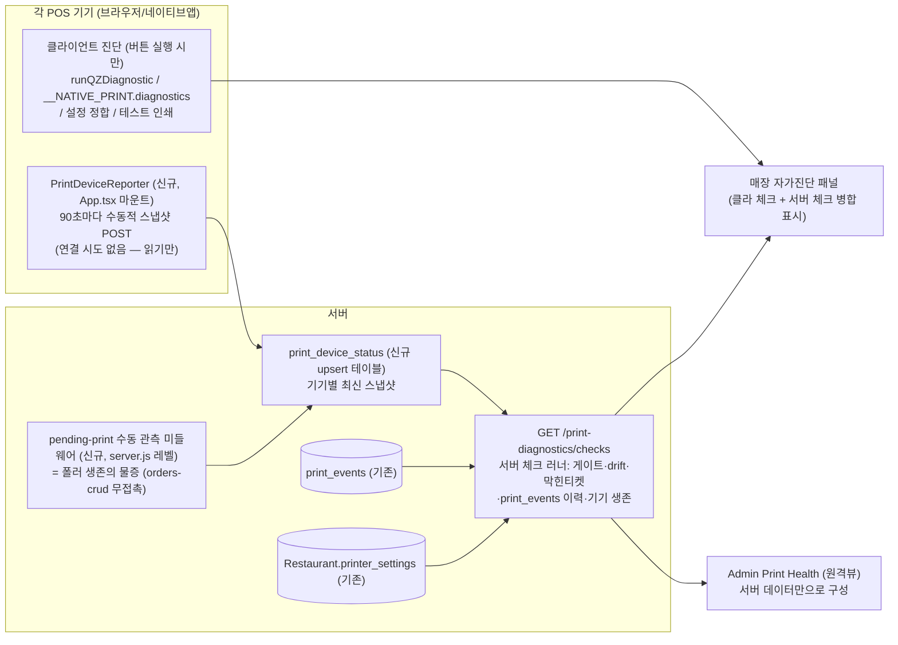

# 인쇄 자가진단 & 원격 지원 시스템 (Print Self-Diagnose & Remote Support)

> 설계일: 2026-07-15. 설계자: Fable (Irene 지시 — 설계·아키텍처 판단은 Fable).
> 요구(Irene 원문): "모든 디바이스 환경별로, 인쇄방식별로 제대로 체크되게. 문제 발생 시 손쉽게 해결. 프로다운 가이드방식."
> 상태: **설계 승인 대기 (구현 전)**.

---

## 0. 기존 설계·인프라와의 관계 (중복 방지 — 실측 결과)

이 문서는 `docs/PRINT_VISIBILITY_DIAGNOSTICS.md`(2026-06-26)를 **대체하지 않고 이어받는다**. 실측한 현재 상태:

| 기존 인프라 | 상태 (2026-07-15 실측) | 본 설계에서의 취급 |
|---|---|---|
| `models/PrintEvent.js` + `routes/print-events.js` (POST 기록 / GET status·summary) | **백엔드 완성·마운트됨**(`/api/print-events`). 단 **프론트 호출 0곳** — POST 기록도, status 폴링도 배선 안 됨. GET status는 클라 이벤트 없이도 서버 추론(no_device/dead_claim)으로 동작 | **핵심 데이터소스로 재사용.** 이력 테이블 신규 생성 안 함 |
| `routes/autoprint-diagnostic.js` (`/api/diagnostic/autoprint`) — preview / clear-stuck-print-flags / seed-missing-printer-configs | 완성·마운트됨. UI 진입점 없음(API만) | **서버 체크 + 원클릭 복구 액션으로 재사용** |
| `runQZDiagnostic()` (billPrint.js export, 5단계: SDK→연결→버전→서명 handshake→silent print. 네이티브 브릿지 분기 내장) | 완성. Settings>Printer "Check Connection" 버튼에 이미 연결 | **클라이언트 진단 엔진으로 재사용·확장 없이 호출** |
| `__NATIVE_PRINT.diagnostics()` (윈도우 Electron preload / 안드 NativePrintPlugin.kt §4 공통 shape: platform/appVersion/printers/defaultPrinter) + 안드 `getSetupState()` | 완성 (앱 0.1.9 / 데스크탑 P2) | 클라이언트 진단에서 호출 |
| 데스크탑앱 진단화면 (Ctrl+Shift+D, `desktop-pos/src/diagnostics/`) — renderCheck 등 | 완성 (개발자용) | 유지. 매장용 패널이 웹 쪽에 생겨도 별개 |
| `[print-trace]` 원격 텔레메트리 (billPrint `_printTrace` → POST /api/orders/print-debug → **console.log만**) | 완성. 네이티브 앱 전용. **DB 저장 아님(pm2 로그)** | 개발자 심층분석용으로 유지. **원격뷰 데이터소스로는 못 씀**(구조화 저장 아님) → 본 설계의 device-report가 그 구조화 버전 |
| `AutoPrintFailureBanner.tsx` | 컴포넌트 완성 + `autoprint-failed` 이벤트 dispatch 5곳 존재(billPrint/poller/MainLayout/hybrid). 그러나 **배너가 어디에도 마운트 안 됨** = 죽은 코드 | App.tsx에 마운트(비보호 파일) + 진단 패널 딥링크 |
| health-check / verify-all / print-route-guard | 완성 (개발자용) | 무접촉. 테스트 §6에서 카테고리만 추가 |

**요지: "측정 장치"는 거의 다 있다. 없는 것은 ①한 화면으로 모으는 조립 ②서버가 기기 상태를 아는 채널 ③원격 지원뷰 ④평이한 문구·가이드·복구 버튼. 본 설계 = 조립이 8, 신규가 2.**

---

## 1. 기능 정의

### 1-1. 목적
인쇄 문제가 나면 지금은 개발자가 pm2 로그를 몇 시간 파헤친다(2026-07-14 withmin 백지 사례). 이를:
- **매장**: 버튼 1개 → 30초 안에 "무엇이 문제고(원인), 뭘 하면 되는지(가이드), 지금 눌러 고칠 수 있는지(복구)"가 나온다.
- **관리자(SA/BG)**: 매장에 전화하기 전에 원격 화면에서 그 매장의 인쇄 건강 상태(기기·설정·이력)를 한눈에 본다.

### 1-2. 사용자
| 사용자 | 화면 | 하는 일 |
|---|---|---|
| 매장 직원/RA | Settings>Printer "인쇄 자가진단" 패널 | 전체 점검 실행, 가이드 따라 해결, 안전 복구 버튼, 테스트 인쇄 |
| System Admin | Admin > Print Health (신규) | 전 매장 인쇄 건강 목록 → 매장 드릴다운(기기·체크·이력) |
| Brand General | 브랜드 매장 목록 확장 (Phase 2) | 자기 브랜드 매장만 동일 뷰 |

### 1-3. 유스케이스
1. **"티켓이 안 나와요"** → 직원이 자가진단 실행 → "자동인쇄 담당 POS(POS1)가 12분째 응답 없음 — POS1 브라우저/앱이 켜져 있는지 확인하세요" (원인 1위를 맨 위에).
2. **"백지가 나와요"** (withmin 사례) → "이 프린터 드라이버는 이미지 인쇄를 못 합니다. 인쇄 형식이 '자동'인데 한글 티켓이라 이미지로 나가고 있어요 → 설정에서 형식을 확인하거나 테스트 인쇄 2종(텍스트/이미지)으로 어느 쪽이 나오는지 확인" + 테스트 버튼 2개.
3. **"BAR 티켓이 주방(KITCHEN)으로 나와요"** → 서버 체크가 station drift 감지(기존 preview 로직): "BAR 스테이션에 프린터가 지정 안 됨 — 품목이 첫 스테이션으로 흡수됩니다" + [스테이션 설정 시딩] 버튼.
4. **관리자 원격 지원**: 매장 전화 → SA가 Print Health에서 해당 매장 열람 → "POS1 앱버전 0.1.8(구버전), 마지막 리포트 2시간 전, 미인쇄 3건 적체" → 정확한 안내 1통화로 종료.

### 1-4. 성공 기준
- 실제 장애 유형(§2-4 체크 카탈로그의 F-계열) 각각에 대해, 해당 상태를 인위 재현하면 진단이 **그 체크를 정확히 fail로** 표시한다 (§6 fault-injection 검증).
- 진단·리포트가 인쇄 경로에 **부작용 0**: check-print-guard **8/8 무변경**, print-route-guard 통과, 자동인쇄 회귀(health-check --category=print) 통과.
- 매장 문구는 전부 평이한 하드웨어 용어(내부 용어 금지 — `PRINT_DEVICE_SETUP_STANDARD.md` §2 원칙), 4개 언어 i18n.

### 1-5. 비범위 (하지 않는 것)
- ⛔ 인쇄 동작(방식/타이밍/라우팅) 변경 일절 없음. **보호파일 8개 무접촉** — billPrint.js는 **이미 export된 함수를 import해 호출만** 한다(파일 수정 0).
- ⛔ PRINT_VISIBILITY_DIAGNOSTICS §5·§6·§4의 보호파일 배선(poller 사유 로그, billPrint 폴백 감지, KDS 수동인쇄 라우팅) — 그 부분은 별도 승인 별도 작업으로 남긴다. 본 설계는 **서버 추론 + 신규 채널만으로** 성립하게 설계했다.
- ⛔ 자동 복구(사람이 안 눌렀는데 시스템이 알아서 고침) 금지. 모든 복구는 명시적 버튼 + 결과 표시.
- ⛔ 진단이 주기적으로 테스트 인쇄를 하는 것 금지(종이 낭비 + 매장 혼란). 테스트 인쇄는 사용자가 누를 때만.

---

## 2. 아키텍처 판단

### 2-1. 핵심 판단: 3소스 병합, 2계층 실행

프린터 도달·QZ 연결·브릿지 존재는 **그 기기에서만** 알 수 있고, 이력·설정·막힌 티켓·"담당 기기가 살아있나"는 **서버만** 안다. 그리고 "다른 기기(POS1)가 지금 어떤 상태인가"는 둘 다 모른다 → 기기가 스스로 서버에 **스냅샷을 밀어 넣는 채널(device-report)** 이 빠진 조각이다.



**판단 근거 3가지:**
1. **폴러 생존은 추론이 아니라 물증으로.** 자동인쇄 기기는 `GET /api/orders/restaurant/:id/pending-print`를 5초마다 호출한다(useAutoPrintPoller:43·MainLayout:1429 실측). server.js에 **라우터 앞 app-level 미들웨어**를 하나 두고 이 경로 호출을 관측(매장별 last-seen, in-memory)하면, orders-crud.js를 한 줄도 안 건드리고 "이 매장에서 폴링 중인 기기 N대, 마지막 폴 n초 전"이 나온다. 기기 단위 귀속은 device-report(90초 주기)의 타임스탬프로 보완한다 — pending-print 요청엔 기기 식별자가 없고, 식별자를 실으려면 폴러(🔒)를 고쳐야 하므로 **안 한다**.
2. **주기 리포터는 보호파일 밖에.** MainLayout.tsx는 print-guard 지문 대상(파일 전체)이라 하트비트를 거기 넣으면 안 된다. 신규 `components/PrintDeviceReporter.tsx`를 **App.tsx에 마운트**(App.tsx는 비보호·이미 `__NATIVE_PRINT` 참조). 리포터는 **읽기만** 한다: localStorage(printerSettings/printerMode/workstation_id), `window.__NATIVE_PRINT` 존재·version, `qz.websocket.isActive()`(연결 **시도 없음** — 상태 읽기만, 권한 팝업 유발 0). 실패해도 무해(fire-and-forget).
3. **능동 진단은 사용자가 누를 때만.** QZ websocket 연결 시도·서명 handshake·프린터 목록 조회·테스트 인쇄는 전부 버튼 실행 시에만(기존 runQZDiagnostic 그대로). 백그라운드에서 연결을 흔들면 그 자체가 인쇄 경로 간섭이다.

### 2-2. 디바이스 × 인쇄방식 매트릭스 — 누가 무엇을 어떻게 측정하나

실측 근거: billPrint.js `shouldUseQZTray`/`sendViaQZTray`(LAN IP 정규식 → raw 소켓)/`sendHTMLViaQZTray`/`printBillViaRawBT`(intent)/`sendTicketAutoFormat`(auto/text/graphic), NativePrintPlugin.kt(listPrinters/diagnostics/getSetupState/LAN·BT), desktop-pos preload(diagnostics/winspool).

| 디바이스 | 방식 (코드 경로) | 클라에서 측정 가능 | 측정 방법 | 측정 **불가**한 것 → 정직한 대체 |
|---|---|---|---|---|
| 윈도우 데스크탑앱 (Electron) | 빌=HTML→OS기본 / 티켓=auto text·image→이름지정 (winspool) | 브릿지 존재·앱버전·OS 프린터 목록·기본 프린터·설정된 이름이 목록에 있는지 | `__NATIVE_PRINT.diagnostics()` (runQZDiagnostic 네이티브 분기가 이미 수행) | 드라이버가 이미지잡을 백지로 뽑는지 → **테스트 인쇄 2종(텍스트/이미지) + "나왔나요?" 확인 기록** (§2-5) |
| 안드로이드 네이티브앱 | LAN raw(소켓)·BT raw·printHtml 래스터 | 브릿지·앱버전·등록 프린터(LAN/BT)·기본 프린터·BT 권한 상태 | `diagnostics()` + `getSetupState()` | LAN 프린터 물리 도달 → MVP는 이력(print_events)+테스트 인쇄. Phase 2: 브릿지에 **connect-only TCP probe**(바이트 0 전송) 추가 — 앱 업데이트 필요라 분리 |
| 브라우저 + QZ Tray | OS이름 프린터=HTML pixel / LAN IP=raw ESC/POS(QZ가 소켓 발송) | QZ SDK·websocket 연결·QZ 버전·인증서 신뢰(서명 handshake 3초 침묵 여부)·OS 프린터 목록 대조 | `runQZDiagnostic()` 5단계 그대로 | LAN IP 프린터 도달 — 브라우저에서 TCP probe 불가, QZ raw로 상태쿼리(DLE EOT)는 응답 회수 미보장 → **설정 정합 + 이력 + 테스트 인쇄만**. "연결 확인됨"으로 절대 위장하지 않음 |
| 브라우저 + RawBT (안드 태블릿/폰) | intent:base64...rawbt (fire-and-forget) | printerMode=rawbt 설정 여부, 프린터 이름 설정 여부 | 설정 읽기만 | **RawBT 앱 존재·발송 성공 자체를 감지 불가**(intent는 반환값 없음) → 테스트 인쇄 + 사용자 확인("나왔어요/안 나왔어요" 버튼)을 print_events에 기록 |
| 태블릿 브라우저 (표시 전용, KDS 등) | 인쇄 안 함 | 이 기기가 인쇄 주체가 아님을 확인 | workstation 바인딩 + autoPrint 플래그 읽기 | — 체크 결과 "이 기기는 인쇄 담당이 아닙니다(정상). 인쇄 담당: POS1(마지막 응답 n초 전)"로 안내 — 엉뚱한 기기에서 진단 돌려도 혼동 없게 |

**정직성 원칙(설계 불변식): 측정 못 하는 것을 초록으로 칠하지 않는다.** 상태값에 `unknown`(확인 불가 — 테스트 인쇄로 확인하세요)을 1급 시민으로 둔다. 가짜초록은 이 시스템의 존재 이유를 부정한다.

### 2-3. 진단 결과 모델 (단일 스키마 — 클라 체크·서버 체크 공통)

```jsonc
{
  "id": "server.poller_alive",        // 체크 카탈로그 ID (아래 §2-4)
  "scope": "server" | "device",       // 어디서 측정했나
  "domain": "print",                  // 확장 대비(§7 판단 ① — 지금은 print 고정)
  "status": "pass" | "warn" | "fail" | "unknown" | "na",
  "severity": "critical" | "major" | "minor",   // fail일 때 정렬·색
  "title":  "i18n key",               // 평이한 한 줄 (예: "자동인쇄 담당 POS가 응답하고 있어요")
  "cause":  "i18n key + params",      // 왜 이런가 (fail/warn/unknown 시)
  "guide":  ["i18n key", ...],        // 사람이 할 일, 순서대로 1~3개
  "fix":    { "type": "api|navigate|test-print",  // 원클릭 액션 (화이트리스트만, §3-3)
              "action": "clear_stuck_flags", "label": "i18n key" },
  "evidence": { ... }                 // 원격뷰/개발자용 원자료 (프린터 목록, 카운트, 타임스탬프)
}
```

### 2-4. 체크 카탈로그 (MVP 18개)

공통(모든 매장) — **서버 체크** (GET /checks가 계산):
| ID | 판정 | fail 시 문구 방향 / 복구 |
|---|---|---|
| S1 `master_gate` | printer_settings의 kitchenPrinter.enabled+autoPrint(워크스테이션 포함) — 자동인쇄 켜진 기기가 설정상 존재하나 | "자동인쇄가 꺼져 있어요" → 설정 이동 |
| S2 `poller_alive` | 관측 미들웨어 last-seen < 30s | **critical** "인쇄 담당 POS가 n분째 응답 없음 — 그 기기의 앱/브라우저를 확인" |
| S3 `stuck_tickets` | needs_print/needs_bill이 60분+ 적체 (기존 clear-stuck 로직과 동일 기준) | "오래된 미인쇄 주문 n건이 걸려 있어요" → **[막힌 티켓 비우기]** (기존 API) |
| S4 `unprinted_now` | print-events GET status 재사용 (45초+ 미인쇄 + 사유) | 사유별 문구 (no_device/dead_claim/…) |
| S5 `station_drift` | 기존 preview warnings 재사용 (스테이션 있는데 프린터 미지정 / 품목 스테이션 미지정) | → **[스테이션 설정 시딩]** (기존 API) + 설정 이동 |
| S6 `printer_config_sane` | method↔address↔name 정합 (qztray인데 address 빈값, LAN IP 형식 오류, rawbt인데 이름 없음 등) | 항목별 지적 + 설정 이동 |
| S7 `recent_failures` | print_events 최근 24h failed/fallback 집계 | "최근 24시간 실패 n회 — 최다: BAR" |
| S8 `device_reports_fresh` | print_device_status에서 autoPrint 담당 기기의 마지막 리포트 < 5분 | "POS1이 h시간 전 마지막 접속 (앱버전 x)" |
| S9 `app_version` | device-report의 앱버전 vs 최신 (네이티브만) | "구버전 앱 — 업데이트 안내" |

**기기 체크** (진단 버튼 누른 그 기기에서, 해당되는 것만 — `na`로 스킵):
| ID | 대상 | 방법 |
|---|---|---|
| D1 `role_identity` | 전부 | 이 기기 = 인쇄 담당인가/표시 전용인가 (workstation_id·autoPrint·__NATIVE_PRINT) — 맨 위에 표시해 기대치 고정 |
| D2 `bridge_or_qz` | 방식별 | 네이티브: diagnostics() / QZ: runQZDiagnostic 1~4단계 / RawBT: `unknown`+테스트 안내 |
| D3 `printers_visible` | QZ·네이티브 | 설정된 프린터 이름(빌+스테이션 전부)이 실제 목록에 있는지 1:1 대조 — **가짜초록의 №1 원인** |
| D4 `cert_trusted` | QZ만 | 서명 handshake 3초 침묵 (기존 로직) |
| D5 `settings_sync` | 전부 | localStorage printerSettings vs 서버 printer_settings 비교 (wipe/드리프트 감지 — 자물쇠 3개 사건 계열) |
| D6 `print_format_fit` | 네이티브·QZ | printFormat(auto/text/graphic) × 설정 프린터 종류 안내 (백지 계열 가이드, 판정은 테스트 인쇄로) |
| D7 `bt_permission` | 안드 네이티브 | getSetupState의 BT 권한 |
| D8 `test_print` | 전부 (버튼) | 명시적 테스트 인쇄(빌/스테이션별/텍스트·이미지 2종) → **"나왔나요?" 예/아니오 → print_events에 success/failed 기록** (RawBT·백지 계열의 유일한 진실) |
| D9 `lan_reach` | Phase 2, 네이티브만 | connect-only TCP probe (브릿지 확장 후) — MVP에선 `unknown` |

### 2-5. 원격뷰 데이터소스 판단
원격뷰는 **서버 데이터만으로** 그린다(원격에서 매장 기기에 명령을 쏘는 원격 실행은 비범위 — 복잡도·보안 대비 가치 낮음, 매장 버튼이 이미 있음): ①print_device_status(기기 목록·버전·모드·마지막 접속) ②서버 체크 결과(S1~S9 — 요청 시 즉석 계산, 저장 안 함) ③print_events 집계(GET summary 재사용) ④미인쇄 현황(GET status 재사용). SA가 "매장 기기에서 진단 실행해 주세요"라고 안내하면 매장이 버튼을 누르고, 그 결과 중 **기기 체크 스냅샷도 device-report로 서버에 올라오므로**(진단 실행 직후 1회 push) SA가 따라 볼 수 있다.

---

## 3. API 설계

### 3-1. 재사용 (변경 없음)
| 엔드포인트 | 용도 |
|---|---|
| `GET /api/diagnostic/autoprint/preview/:restaurantId` | S5 station drift + 라우팅 미리보기 |
| `POST /api/diagnostic/autoprint/clear-stuck-print-flags/:restaurantId` | 복구: 막힌 티켓 비우기 |
| `POST /api/diagnostic/autoprint/seed-missing-printer-configs/:restaurantId` | 복구: 스테이션 설정 시딩 |
| `GET /api/print-events/restaurant/:id/status` · `/summary` | S4 미인쇄+사유 / S7 집계 |
| `POST /api/print-events` | D8 테스트 인쇄 결과(사용자 확인) 기록 |

### 3-2. 신규 — `routes/print-diagnostics.js` (신규 파일 판단: autoprint-diagnostic.js는 "preview+복구"로 잘 스코프됨(295줄). 성격이 다른 체크러너·기기레지스트리·fleet을 얹으면 500줄 규칙 위반 + 뒤섞임 → 신규 파일, `/api/print-diagnostics` 마운트)
| 엔드포인트 | 미들웨어 | 내용 |
|---|---|---|
| `GET /restaurant/:restaurantId/checks` | `authenticateToken, checkRestaurantAccess` | 서버 체크 S1~S9 실행 → §2-3 모델 배열. 계산만, 저장 없음 |
| `POST /device-report` | `authenticateToken` (자기 restaurant_id 스코프 — body의 restaurant_id 신뢰 안 함) | 기기 스냅샷 upsert(device_id 기준). 90초 주기 + 진단 실행 직후 1회 |
| `GET /restaurant/:restaurantId/devices` | `authenticateToken, checkRestaurantAccess` | 기기 목록 + 폴링 관측(last-poll) 병합 |
| `GET /fleet` | `authenticateToken, requireRole('System Admin','Brand General')` + BG는 소유 브랜드 매장으로 서버측 필터(brands 소유관계로 IN 절 — IDOR 스윕 규칙 준수) | 매장별 요약 1행(심각도 최고치·미인쇄 수·담당기기 생존·마지막 리포트) — 원격뷰 목록 |

보안: 표준 3단계 준수. 기존 autoprint-diagnostic·print-events의 수기 role 체크(SA or 본인 매장)는 **그대로 두되**(무접촉), 신규 라우트는 `checkRestaurantAccess` 표준 미들웨어 사용. rate: device-report는 기기당 90초 1회라 기존 API limit 내 무해.

### 3-3. 복구 액션 화이트리스트 (fix.type=api가 호출 가능한 전부)
`clear_stuck_flags` · `seed_station_configs` · (클라 로컬) `reconnect_qz`(connectQZTray 재시도) · `resync_settings`(서버 printer_settings를 이 기기 localStorage로 재로드 — 기존 설정 로드 경로 재사용, 쓰기 방향은 서버→로컬만) · `navigate_settings` · `test_print`. **이 밖의 어떤 액션도 UI가 만들 수 없다** (렌더러가 화이트리스트 밖 fix를 무시).

---

## 4. DB 판단

**이력 테이블 신규 불필요** — print_events가 정식 저장소(이미 존재·인덱스·30일 정리 설계 포함). `[print-trace]`는 pm2 로그 전용이므로 데이터소스로 안 쓴다(대신 device-report가 구조화 스냅샷 제공).

**신규 1테이블만**: `print_device_status` (기기당 1행 upsert — 로그 아님, 무한증가 없음)
```
print_device_status
  id               BIGINT PK
  restaurant_id    INT (idx, FK)
  device_id        VARCHAR(64)   -- 기기 자체 발급 uuid(localStorage 영속), (restaurant_id, device_id) UNIQUE
  workstation_id   VARCHAR(64) NULL
  label            VARCHAR(120)  -- "POS1 (Windows 앱)" — 표시명
  platform         VARCHAR(32)   -- windows-app / android-app / web-qz / web-rawbt / web
  app_version      VARCHAR(32) NULL
  printer_mode     VARCHAR(16)   -- qztray/rawbt/browser
  is_auto_print    BOOLEAN       -- 이 기기가 자동인쇄 담당 설정인가
  qz_active        BOOLEAN NULL  -- websocket isActive (읽기만)
  snapshot         JSON          -- 프린터 목록·설정 요약·마지막 진단 결과(기기 체크)
  last_report_at   DATETIME (idx)
  last_diag_at     DATETIME NULL
  created_at/updated_at
```
마이그: 멱등 `scripts/migrate-print-device-status.js` + `migrations.registry.json` `deploy` 등록 + 끝에 `process.exit()` (배포 규율 3종 준수). 폴링 관측(last-poll)은 **in-memory** (`services/printDeviceRegistry.js` Map) — "지금 살아있나"가 질문이라 재시작 후 30초면 다시 차니 DB 불필요.

---

## 5. UI 흐름

### 5-1. 매장 자가진단 패널 — Settings > Printer 탭 (기존 진단 스텝 UI 자리 확장)
진입 판단: **설정>프린터가 정위치**(이미 "Check Connection"이 거기 있고, 프린터 문제의 사용자 멘탈모델도 거기). 플로어플랜 헤더에 상시 버튼은 두지 않는다(POS UI 컨트롤 고정 원칙 + 평시 소음). 대신 **AutoPrintFailureBanner를 App.tsx에 마운트**(이벤트 dispatch 5곳은 이미 살아있음)하고 배너의 버튼이 이 패널로 딥링크 — "문제가 생겼을 때만" 진단으로 이끄는 프로다운 동선.

패널 구성 (RA 표준 컴포넌트 — DataTable/Button/Modal, 장식 이모지 금지·상태는 텍스트 글리프 ✓✕):
```
[이 기기: POS1 · Windows 앱 0.1.9 · 인쇄 담당]          ← D1 정체성 먼저
[전체 점검 실행]  (실행 중: 행별 ▶→✓/✕)
──────────────────────────────
✓ 자동인쇄 담당 POS 응답 중 (3초 전)                    ← 서버 체크
✕ BAR 프린터가 이 PC 프린터 목록에 없어요                ← 기기 체크 D3
   왜: 설정된 이름 "BAR"이 Windows 프린터 목록에 없음
   가이드: 1) 프린터 전원·USB 확인  2) Windows 설정에서 이름 확인
   [테스트 인쇄] [프린터 설정 열기]
! 오래된 미인쇄 주문 3건이 걸려 있어요
   [막힌 티켓 비우기]  → 실행 결과 즉시 표시("3건 정리됨")
? 프린터 실제 출력은 자동으로 확인할 수 없어요
   [테스트 인쇄(텍스트)] [테스트 인쇄(이미지)] → "나왔나요? [예/아니오]"
```
정렬: fail(critical→major) → warn → unknown → pass. 전부 pass면 상단 요약 1줄("인쇄 체계 정상 — 검사 18항목 통과").

### 5-2. 원격 지원뷰 — Admin > Print Health (신규 페이지, 사이드바 등록)
- 목록: DataTable — 매장 | 상태(최고 심각도) | 미인쇄 | 담당기기 마지막 응답 | 기기 수 | 마지막 진단. `/fleet`.
- 드릴다운(행 클릭): StatCard 요약 + ①서버 체크 결과 ②기기 카드들(플랫폼·버전·모드·마지막 리포트·마지막 진단 스냅샷) ③print_events 집계/최근 50건. **원격 실행 버튼 없음** — "매장에 이 버튼 누르게 안내" 문구.
- BG: Phase 2에서 같은 컴포넌트를 브랜드 스코프로 재사용.

### 5-3. i18n
신규 namespace `diagnostics` (또는 settings 확장) — en→ko→zh→ms 4언어, 체크 문구는 glossary 등록. 내부 용어(폴러/claim/하이브리드) 화면 노출 금지 — "인쇄 담당 POS", "막힌 티켓" 같은 평이어만.

---

## 6. 테스트 시나리오 — "진단이 진실을 말하는지" 검증

핵심: **fault-injection 매트릭스** — 각 체크를 일부러 그 상태로 만들고 진단이 정확히 그 체크를 fail로 띄우는지. 데모 매장(dev id=38)에서:

| # | 주입 | 기대 |
|---|---|---|
| 1 | QZ Tray 종료 후 진단 | D2 fail("QZ Tray가 실행 중이 아니에요") — 나머지 서버 체크는 정상 표시 |
| 2 | 설정 프린터 이름을 오타로 변경 | D3 fail + 이름 대조 evidence |
| 3 | 데모 주문에 needs_print=true·created 2시간 전 시딩 | S3 fail → [막힌 티켓 비우기] → 재진단 pass (복구 왕복) |
| 4 | 스테이션 추가·프린터 미지정 | S5 fail → [시딩] → pass |
| 5 | 자동인쇄 기기 폴링 중단(브라우저 닫기) | 30초 내 S2 fail, 재시작 시 pass |
| 6 | localStorage 설정을 서버와 다르게 조작 | D5 warn + [설정 다시 불러오기] |
| 7 | 테스트 인쇄 "아니오" 응답 | print_events에 failed 기록 → S7 반영 확인 |
| 8 | 표시 전용 태블릿에서 진단 | D1이 "인쇄 담당 아님(정상)" — false alarm 0 |
| 9 | device-report 90초 주기 | print_device_status upsert 1행 유지(증식 없음) |
| 10 | 권한: Staff가 타 매장 :restaurantId 호출 / BG가 타 브랜드 fleet | 403 (health-check에 케이스 추가) |

디바이스×방식 커버리지: 윈도우앱·안드앱(에뮬 purplepos-ci — 단 서버 굶김 함정 주의: 빌드와 동시 실행 금지)·브라우저+QZ(개발 PC)·RawBT(실기기, Irene 확인)·표시전용. **에뮬/헤드리스로 종이는 못 본다** — D8 실물 확인은 매장/Irene 1회(아래 게이트).

자동 게이트: ①check-print-guard **8/8 무변경**(bless 불필요가 목표이자 검증) ②print-route-guard 7/7 ③health-check --category=print + 신규 diagnostics 케이스 추가 ④verify-all ⑤실브라우저 mount(Settings/Admin Print Health — 운영 critical 페이지 규칙) ⑥`npm run i18n:verify`.

---

## 7. 추가 판단 (지시받은 3건)

**① 범위 — 인쇄 전용으로 구현하되, 그릇은 도메인 중립으로.**
권고: MVP는 인쇄만. 단 체크 결과 모델에 `domain` 필드, 렌더러(체크 리스트 UI)와 fleet 요약을 domain-agnostic으로 설계해 두면 주문/결제/오프라인 진단은 "체크 카탈로그 추가"만으로 같은 레일을 탄다. 이유: 지금 아픈 곳은 인쇄이고(7월 내내), 결제·오프라인은 실패 모델이 달라 지금 일반화하면 추상화가 관념이 된다 — 그릇만 넓히고 내용은 좁게(최소 범위 원칙).

**② Fable 게이트 / 실프린터 검증 대상 표시**
- Fable 게이트 **해당**: ⑤보안 경계(신규 fleet 라우트의 SA/BG 스코프·IDOR) + ③운영 DB 마이그(신규 테이블) + server.js 미들웨어 추가(마운트 순서). 구현 완료 시 check-sensitive-diff 실행 + Fable 검증 1회.
- 실프린터 검증: **D8 테스트 인쇄 버튼 1회**(빌+스테이션, 텍스트/이미지 2종)만 실물 확인 필요 — 기존 export 함수 호출이라 인쇄 경로 자체는 무변경이지만, "진단이 안내한 대로 종이가 나온다"는 이 기능의 계약이므로 매장 왕복 1회에 묶는다(🔒 프로세스 §5).
- 보호파일: **접촉 0이 설계 제약이자 검증 항목** — 구현 후 check-print-guard 변경 0건이어야 하고, 떴다면 구현이 설계를 벗어난 것(즉시 되돌림).

**③ 규모·단계**
| 단계 | 내용 | 규모(추정) |
|---|---|---|
| **MVP (1뭉치)** | routes/print-diagnostics.js + print_device_status 마이그 + 폴링 관측 미들웨어 + PrintDeviceReporter + Settings 자가진단 패널(체크 18종·복구 3종·테스트 인쇄 확인 기록) + AutoPrintFailureBanner 마운트+딥링크 + Admin Print Health(SA) + i18n 4언어 + 테스트 §6 | 백엔드 신규 ~3파일, 프론트 신규 ~4파일 + SettingsPage·App.tsx·사이드바 수정. 중~대(2~3일). 보호파일 0 |
| Phase 2 | BG fleet 뷰 · 안드/데스크탑 브릿지 LAN connect-probe(D9, 앱 버전업 동반) · RestaurantsPage 행 배지 | 소~중, 별도 승인 |
| 별도 트랙(본 설계 아님) | PRINT_VISIBILITY_DIAGNOSTICS §5·§6 잔여(보호파일 배선 — poller 사유 로그·폴백 감지·KDS 수동인쇄 라우팅) | 🔒 bless+실프린터 필요 — 원할 때 독립 승인 |

---

## 8. 핵심 판단 요약 (Irene 확인용)

1. **새로 만드는 게 아니라 조립이다.** 측정기(runQZDiagnostic·브릿지 diagnostics·preview·복구 API·print_events)는 이미 있고 상당수 휴면 상태다(print-events 프론트 배선 0곳, 실패 배너 미마운트). 본 설계 = 이들을 한 화면과 한 스키마로 묶고, 빠진 조각 둘(기기→서버 스냅샷 채널, 폴러 생존 관측)만 신설.
2. **보호파일 접촉 0으로 성립한다.** billPrint는 export 함수 호출만, 폴러 생존은 server.js 미들웨어 관측(orders-crud 무접촉), 주기 리포터는 App.tsx 마운트(MainLayout 무접촉). check-print-guard 8/8 무변경이 완료 조건.
3. **측정 못 하는 건 안 하는 척 안 한다.** RawBT 존재·브라우저에서 LAN 도달·드라이버 백지는 자동판정 불가 → `unknown` + 명시적 테스트 인쇄 + "나왔나요?" 사용자 확인을 print_events에 기록. 가짜초록 금지가 1급 설계 불변식.
4. **DB는 upsert 1테이블(print_device_status)만.** 이력은 기존 print_events 재사용, print-trace(pm2 로그)는 데이터소스로 안 씀. 원격뷰는 서버 데이터만으로 구성(원격 명령 실행 비범위).
5. **범위는 인쇄 전용, 그릇만 확장형.** 체크 모델에 domain 필드만 두고 주문/결제/오프라인은 나중에 카탈로그 추가로.

### 승인 대기 항목
- [ ] 전체 설계 방향(2계층+3소스, 조립 우선) 승인
- [ ] 신규 테이블 print_device_status 1개 + 신규 라우트 파일 1개 승인
- [ ] AutoPrintFailureBanner 마운트(App.tsx) — 실패 시 상단 배너가 이제 실제로 뜨게 됨 (UX 변화 있음) 승인
- [ ] 원격뷰 = Admin 신규 "Print Health" 페이지(SA 먼저, BG는 Phase 2) 승인
- [ ] MVP 1뭉치 범위(§7-③) + 매장 실물 확인은 테스트 인쇄 1회로 묶기 승인
- [ ] (별도 트랙) PRINT_VISIBILITY_DIAGNOSTICS 잔여 보호파일 배선은 이번에 안 함 — 확인
