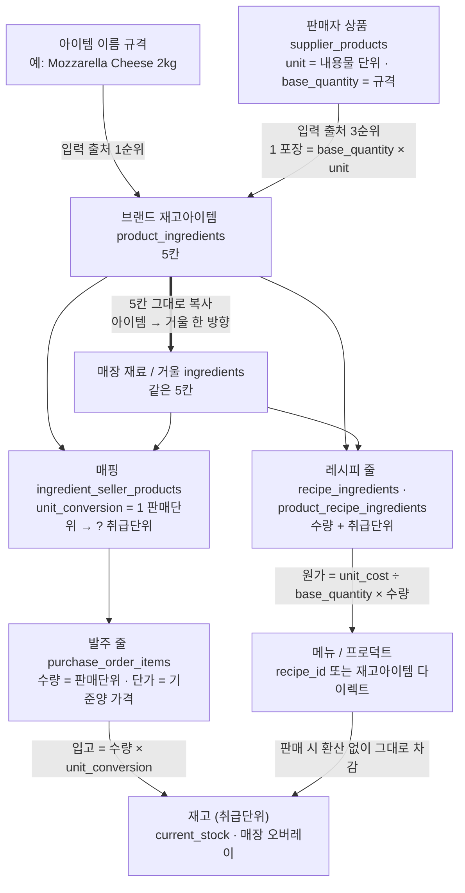

# 구입 · 판매 · 브랜드 구조 (정석)

> 이 문서가 **단일 기준**이다. 발주·원가·재고 관련 판단은 여기부터 읽는다.
> 다른 문서(`PURCHASE_ORDER_SYSTEM.md` 등)는 작업 기록이고, 구조가 궁금하면 이 문서를 본다.
> 최초 작성 2026-09-04. 내용은 Irene 이 정의한 구조 그대로이며, 임의로 고치지 않는다.

---

## 1. 정석 — 세 줄

1. **UGS → GIT**: UGS 는 GIT 의 공급업체다. GIT 가 UGS 물건을 자기 프로덕트로 등록하면 **재판매**이고, GIT 의 원가 = UGS 가격이다.
2. **K-소스 → GIT 이 직접 만든다**: 프로덕트에만 있고, 거기 **프로덕트 레시피**가 붙고, 레시피가 재료를 가리키고, 그 재료가 GIT 재고이고, 재고가 공급업체와 연결된다. GIT 의 원가 = 레시피 재료비 합계.
3. **GIT → 매장(K-DINE IPC · with MIN Cafe …)**: 위 어느 경우든 **매장에게 공급업체는 GIT** 이다. **매장 원가 = GIT 판매가.** 끝.

> Irene 원문(2026-09-04): "UGS는 GIT 의 공급업체이고 이 상품을 프로덕트로 등록하면 K-DINE IPC나 위드민은 GIT가 공급업체지. …
> K소스 시리즈는 GIT가 직접 제조하는 제품이니까 그냥 프로덕트에만 있고 레시피가 있고 그게 재료가 연결되어 재료들이 재고이고 그게 공급업체랑 연결된거고.
> 레스토랑들에는 GIT가 공급업체인건 동일하지"

---

## 2. 가격은 어디에 사는가

**GIT 프로덕트 한 곳.** 그 화면의 `단가` 가 GIT 판매가이고, 그것이 매장의 원가다. 매장마다 따로 정하는 가격은 **없다.**

용어는 두 단어만 쓴다 — **원가 / 판매가**. 매입가 같은 제3의 단어를 새로 만들지 않는다.
(화면의 칸 이름 `단가` 는 **판매가**를 뜻한다 — 칸 이름일 뿐 개념은 판매가다.)

### 원가는 2경로뿐
- **재판매 프로덕트** → 공급업체(판매자)가 가진 가격이 그대로 원가.
- **레시피 있는 프로덕트** → 레시피 재료비 합계가 원가. 각 재료의 원가는 다시 위 1번으로 풀린다.

평균가·특정시점가 같은 정책 분기는 **없다.**

### 2-1. 프로덕트는 둘 중 하나다 (2026-09-04 Irene 확정 · 이전 결정 대체)

> Irene 원문 ① **"프로덕트=재고아이템 or 프로덕트=레시피=재고아이템 이렇게야."**
> Irene 원문 ② **"그냥 재고아이템 바로 연결하는 건데. 그대로 메뉴이고 그대로가 프로덕트인데."**

- **프로덕트 = 재고아이템** — 프로덕트가 재고아이템 **하나**를 그대로 가리킨다.
  1개 팔면 그 재고아이템 1개가 빠진다. 원가 = 그 재고아이템 원가(= 공급업체 가격, §2 재판매).
  **수량·단위 환산 없음** — "그대로"다.
- **프로덕트 = 레시피 = 재고아이템** — 지금 레시피 그대로.
- **둘 중 하나만.** 둘 다 걸면 저장 거부(`LINK_EXCLUSIVE`). 둘 다 없으면 목록에 `Not linked` 로 보인다.
- 이름은 **재고아이템 다이렉트 / Stock Item (direct)**. 브랜드 프로덕트와 매장 메뉴가 **같은 화면**이다.
- 매장 메뉴도 같은 규칙 — 메뉴 = 재고아이템 또는 메뉴 = 레시피 = 재고아이템.

⛔ **세 번째 길을 만들지 말 것.** 실제 사고: `Ingredients (direct)` 가 이름만 다이렉트였고,
실체는 재료를 여러 줄·수량까지 받아 `"<이름> (auto)"` 레시피를 몰래 만들어 붙이는 것이었다
(`routes/menu.js` · `routes/brand-products.js`). 화면에선 레시피가 아닌 척 숨겼다.
= 레시피에 이름표만 바꿔 단 것이고, "둘 중 하나"에 없는 길이었다.

**재료 0줄 레시피는 자동으로 끊지 않는다.** 사람이 걸어둔 미완성 레시피일 수 있고,
조용히 상태를 바꾸는 것은 위에서 없앤 "세 번째 길"과 같은 종류다. 대신 **ING-UNI-010** 이
"연결돼 보이는데 차감 0"인 행을 목록으로 드러낸다(비차단). 연결은 사람이 화면에서 한다.

**자동 강제:** 인스펙션 `ingredient-unification` — 008(레시피 FK 와 재고아이템 FK 동시 보유 0건) ·
009(` (auto)` 이름 레시피 0건)가 배포 게이트에서 fail-closed. 010 은 비차단 목록.

---

### 2-2. 단위 모델 — 다섯 칸 (2026-09-05 Irene 확정)

> Irene 원문 ① **"2kg가 1 pack인데 발주하는 기본 단위랑 레시피에 사용하는 단위랑 다르면 어떻게 해?"**
> Irene 원문 ② **"취급 기준숫자(Base Qty), 취급단위(unit), 기준양, 기준단위, 가격 이렇게 있어야 하는 거야. 가격은 기준양의 가격이고"**
> Irene 원문 ③ **"기준양의 가격은 발주기준이야."**
> Irene 원문 ④ **"포장단위가 우리가 말하는 기준단위야. … 취급단위라고 하는 unit이 우리 내부 사용단위 맞지?"**

**한 줄:** `1 pack(기준단위) = 2000 g(취급단위) = RM 93(가격, 발주 단가)`

| 한글 (정식 명칭) | 영어 라벨 | DB 칸 | 치즈 예 | 뜻 |
|---|---|---|---|---|
| **취급단위** | Usage Unit | `unit` | `g` | **우리 내부 사용단위.** 레시피·재고·차감이 전부 이 단위 |
| **취급 기준숫자** | Base Qty | `base_quantity` | `2000` | **기준양 전체에 든 취급단위 양 = 가격이 사는 양** |
| **기준단위(포장)** | Package Unit | `package_unit` | `pack` | 포장·발주 단위 |
| **기준양** | Package Qty | `package_quantity` | `1` | 가격이 가리키는 포장 수(보통 1) |
| **가격** | Price / Package | `unit_cost` | `93` | 기준양의 가격 = **발주 단가** |

**항등식:** `base_quantity × 취급단위 = package_quantity × 기준단위 = unit_cost 가 가리키는 것`
치즈 → `2000 g = 1 pack = RM 93`.

> **기준양이 1 이 아닌 경우** (운영 사례 없음, 정의용): 6병 묶음으로 가격이 붙는 음료 —
> 기준단위 `bottle` · 기준양 `6` · 취급단위 `ml` · 취급 기준숫자 `1980`(= 6 × 330) · 가격 `RM 12`(6병 값).
> ml 당 원가 = 12 ÷ 1980. 병당 용량은 1980 ÷ 6 = 330 ml 로 **계산**한다(저장하지 않는다).

**파생값 — 따로 저장하지 않는다. 계산해서 나온다.**
- 취급단위당 원가 = `unit_cost ÷ base_quantity` = 93 ÷ 2000 = **RM 0.0465 / g**
- 레시피 줄 원가 = 취급단위당 원가 × 줄 수량 → `40 g` = **RM 1.86**
- 재고 표기 = 취급단위 + 괄호 환산 → `5,920 g (2.96 pack)`

**이 다섯 칸은 세 표가 똑같이 갖는다** — 브랜드 재고아이템(`product_ingredients`) · 매장 재료(`ingredients`) · 거울(= 재고아이템을 브랜드에 공유한 `ingredients` 행). 거울은 아이템에서 **다섯 칸 그대로 복사**되며 방향은 아이템 → 거울 한 방향뿐(§`INGREDIENT_UNIFICATION_DESIGN.md` F2).

#### 어디서 무슨 단위를 쓰는가

- **레시피는 취급단위만 쓴다.** `40 g`. 포장을 모른다.
- **발주는 판매자 단위로 센다.** `3 pack`. 매핑 `ingredient_seller_products.unit_conversion` = **"1 판매단위 = ? 취급단위"** (치즈 2000). 입고 = `수량 × unit_conversion` 취급단위 = +6000 g.
  - **발주 줄 단가는 그 판매자 매핑의 `unit_price`** — 판매자마다 값이 다를 수 있고 실제 PO 는 매핑 가격을 쓴다. 아이템 `unit_cost` 는 **원가 계산의 기준양 가격**이며 발주 기준으로 적는다(§2 원가 2경로).
  - **환산 기본값** = 판매단위가 기준단위와 같으면 `unit_conversion = base_quantity ÷ package_quantity` (치즈 2000). 그 판매자가 다른 포장으로 팔면(1 kg 봉지) 그 매핑만 1000.
- **판매 차감은 환산하지 않는다.** `inventoryDeductionService.js` 가 레시피 줄 수량을 그대로 뺀다 — 그래서 **"레시피 줄 단위 = 재료 취급단위"가 불변식**이고, 인스펙션 `ING-UNI-011/012` 가 이걸 지킨다.
- **재고는 어디서나 취급단위로 센다.** 브랜드 창고도 g. 화면이 괄호로 포장 환산을 같이 보여준다.
- **취급단위는 레시피 줄이 하나라도 붙어 있으면 바꿀 수 없다** — `UNIT_LOCKED_BY_RECIPES` 409, 브랜드·매장 공통. 바꾸려면 **줄 수량·재고·매핑 환산을 같은 트랜잭션에서 함께 환산**한다(P1 수렴 스크립트, 이후 P2 화면). 바꾸는 순간 `20 g` 이 `20 pack` 이 되기 때문이고, 이것이 Irene 이 화면에서 만난 에러의 자리다.

#### 관계도

**입력 출처 우선순위:** 이름 규격 > 거울이 이미 가진 값 > 판매자 상품 규격 > 취급 값 복사(기준 = 취급).

#### 지금 틀린 자리 (2026-09-05 운영 실측)

**취급단위 칸에 기준단위 값이 앉아 있다.** 브랜드 재고아이템 310건 중 **254건**(pack 139·piece 85·bottle 25·can 5), 매장 재료 404건 중 **301건**이 `unit` 에 포장단위를, `base_quantity` 에 1 을 넣고 등록돼 있다. 그래서 `Mozzarella Cheese 2kg` 는 **어디에도 2000 이 기록돼 있지 않고**, 레시피에 `0.02 pack` 으로 들어가 있다.

- 브랜드 쪽은 거울이 옛 모델(`g / 1000`, `kg / 5`)을 그대로 갖고 있어 **레시피 302줄은 지금도 맞게 돈다** — 어긋난 아이템 18건.
- 매장 쪽은 아예 비어 있으나 **레시피 줄이 13줄뿐이라 아직 안 터졌다.** 이름 59건·판매자 규격 81종에 답이 적혀 있다.
- 공급업체 화면만 처음부터 옳게 안내하고 있었다 — `ko/supplier.json` **"Unit 에는 내용물 단위(kg·g), Base Qty 에는 그 양(예: 5)을 넣으세요"**. 즉 판매자 상품의 두 칸은 이미 취급단위/취급 기준숫자다.

⛔ **같은 개념에 다른 말을 쓰지 말 것.** 화면마다 "기본 수량"·"기준 수량"·"Base Qty / Unit" 이 섞여 있던 것이 혼동의 절반이었다. 위 표의 다섯 이름만 쓴다.

---

## 3. "재료"가 두 군데인 이유 — 주방이 둘이다

같은 "재료"라는 말을 쓰지만 **주인이 다르다.**

| 화면 | 무엇인가 | 누가 쓰는가 |
|---|---|---|
| **Stock Items** | **GIT 공장의 재고** — UGS 등에서 사오는 포장재·원재료 | **프로덕트 레시피**(K-소스 제조)가 소비한다 |
| **Shared Ingredients** | **K-DINE 매장 주방의 재료** — 매장이 사서 쓰는 것 | **브랜드 레시피**(매장 메뉴)가 쓰고, 매장이 **발주**한다 |

- K-Jjamppong Sauce 가 Shared Ingredients 에 있는 것은 **매장이 사서 쓰는 재료**이기 때문이다.
- Stock Items 에 넣은 것은 브랜드 레시피 재료 목록에 **나오지 않는다.** 두 목록은 서로 참조하지 않는다.
- 이건 개념이 둘이어서가 아니라 **구현이 따로 지어졌기 때문**이다(§5-2 참조). 개념은 하나다 — 재고 아이템 = 재료, 주인이 누구냐만 다르다.

### 레시피도 두 계통이다 (섞지 말 것)
- **프로덕트 레시피** — GIT 프로덕트가 무엇으로 만들어지는가. GIT 재고(Stock Items)를 소비한다.
- **브랜드 레시피** — 매장 메뉴가 무엇으로 만들어지는가. 매장 재료(Shared Ingredients)를 소비한다.

---

## 4. 매장이 GIT 물건을 사는 흐름

**정석:** GIT 프로덕트 → 매장 발주 → 입고 → 재고 증가.

발주서에 찍히는 값은 **GIT 판매가**여야 한다.

지금 구현은 그 사이에 "매장이 그 물건을 자기 재료 목록에 올리는" 단계가 하나 더 끼어 있다 → §5-1.

---

## 5. 지금 구현이 정석과 다른 곳

정석대로 되어 있지 않은 지점들이다. 발주·원가에서 이상한 숫자를 보면 먼저 이 목록을 의심한다.

### 5-1. 매장마다 가격 복사본이 따로 산다 ⚠ 가장 큰 것
매장이 GIT 물건을 자기 재료 목록에 올리는 순간, **GIT 가격이 매장 쪽에 숫자로 복사된다.** 발주서는 그 복사본을 읽는다.
그래서 **GIT 가 가격을 바꿔도 매장 쪽은 따라가지 않는다.**

- 정석: 매장은 GIT 프로덕트를 **그대로 보고 현재 가격으로** 주문해야 한다(복사 없음).
- 실제로 생긴 일:
  - K-DINE IPC 에 옛 가격이 굳어 있었다(**7건 14칸** — K-소스 4건 49.90/54.90 + 포장재 3건). 2026-09-04 정정 완료, 매장 8 GIT 연결 9/9 일치 확인.
  - with MIN Cafe 는 아예 **다른 행**(§5-2)에 붙어 있었다.
- **담당:** 구조 개편(Fable). 브랜드 → 자기 매장 거래는 복사 없이 GIT 가격 참조로 바꾼다.

### 5-2. 재료 테이블이 둘, 카테고리 테이블이 셋
- 재료: GIT 재고(Stock Items)와 매장 재료(Shared Ingredients)가 **다른 테이블**이고, 둘을 잇는 장치는 읽기만 따르고 쓰기는 무시한다.
- 카테고리: 재료용·GIT 재고용·옛 잔재용으로 **세 벌**이 따로 있다.
- Stock Items 카테고리 안의 중복 4건(빈 3건 삭제 · `MEAT`→`Meat` 개명) — **2026-09-04 정리 완료**(남은 18건, 중복 없음).
- **해결됨 (2026-09-04, SW 4.78)** — Stock Items 로 통합 완료. 재료를 만드는 길은 하나이고, 매장 재료 행은 그 거울이다.
  출처는 둘 중 하나 — GIT 이 **사는 것**=Stock Item / **파는 것**(프로덕트)=프로덕트 자체가 재고.
  설계·증명 = `docs/INGREDIENT_UNIFICATION_DESIGN.md`.
  ⚠ **관리자 화면 몫으로 남긴 것**: 재고아이템 안 같은 물질 7건(소주 3종·밥그릇 L/M/S·뚜껑 큰/작은·김치 할랄/포기·깐마늘·호떡·봉투 L/XL) ·
  K-소스 이름 3건(K-Soy·K-Yukgaejang·K-Kimchi — 긴 이름 후보가 둘씩) · 303 깐마늘·157 호떡 환산비.
  전부 **데이터로 못 정해 손대지 않은 것**이고, Stock Items 화면에서 이름을 고치면 브랜드 쪽에 따라간다.

### 5-3. GIT 판매상품에 같은 물건이 두 줄씩 있었다 — **해결됨**(2026-09-04)
UGS 상품이 GIT 판매상품 자리에 매입가 그대로 복사된 행(`SP-*`)이 50건 있고, with MIN Cafe 가 **전부 그쪽에 물려 있다**(그 값으로 나간 발주 1건이 입고 완료).
GIT 프로덕트(`PRD-*`)로 **이관 완료**(연결 50건·92칸, 중복행 50건 비활성, 증명 50/50 · SP 잔여 0).
- 뿌리: 2026-08-28 사고(공급업체 원가를 판매가 자리에 복사).
- **재발 방지:** 공급업체 상품을 자기 판매상품으로 등록하는 정식 화면이 없어 스크립트로 때운 것이 원인이다. 화면이 생기기 전까지 같은 작업은 반드시 드라이런 → 검토 → 승인 순서로.

### 5-4. 포장 단위 표기가 케이스와 봉지로 섞여 있다
공급업체 쪽 이름은 케이스 표기(`50PCS X 12PKTS`), GIT 쪽은 봉지 표기(`50PCS/PKT`)인데 환산비는 1.0 이다.
숫자를 옮기기 전에 **두 값의 단위가 같은지 먼저 확인한다.** 팩당 개수를 안 곱해 50배 틀린 사고가 있었다.

**단위 자체의 정의는 §2-2 "단위 모델 — 다섯 칸" 이 단일 기준이다.** 케이스·봉지가 섞여 보이는 것은 대개 **취급단위 칸에 기준단위(포장) 값이 들어가 있는 것**이다 — 먼저 §2-2 에 대조한다.

### 5-5. 판매가가 정해지지 않은 GIT 프로덕트가 있다
프로덕트는 등록됐는데 `단가` 가 0 인 것들이 있다. **0 = "아직 정하지 않음"** 이고, 0 인 채로 매장에 내려보내면 금액 0 짜리 발주가 나간다.
- 규칙: 가격을 옮길 때 **0 은 "결정 없음"으로 취급해 덮어쓰지 않는다.** 지금 값을 유지하고, Irene 이 정하면 그때 맞춘다.
- 실측(2026-09-04): 판매가 0 인 GIT 프로덕트 **36건**, 그중 with MIN 이 실제로 사는 것 **28건**(Irene 입력 대기).

### 5-6. `general_stock_categories` 잔재
소문자 이름 3건이 남아 있고 참조는 거래 테이블 하나뿐이다. 옛 흔적으로 보이며 지금은 손대지 않는다.

### 5-7. 프로덕트 자체 재고(`current_stock`)는 정석 밖

`products.current_stock` / `brand_products.current_stock` — 프로덕트 행 **자체에 수량을 두는** 경로가
2026-08-22·09-01 에 따로 지어져 있다. 팔리면 거기서 빼고 발주도 거기로 들어온다.
**재고아이템 목록에는 안 나오는 숨은 재고**다. 그래서 dev 에 `PEACH BASE` 가
프로덕트(PRD-035)와 재고아이템(PI-005) 두 줄로 있고 서로 모른다.

- 실측(dev, 2026-09-04): 이 경로에 **수량이 있는 행 0건**(브랜드 32 · 매장 88 전부 0). **운영은 미측정.**
- 이번 라운드는 **무접촉**이다 — 운영에 배포된 경로라 운영 수치를 먼저 재야 한다.
- 대신 **다이렉트 연결이 있으면 그쪽이 우선**이고, 다이렉트 연결된 프로덕트는 **발주 줄로 사는 것을 막는다**
  (레시피 프로덕트와 같은 규칙 — 재고아이템을 사라).
- 자동으로 재고아이템을 만들어 붙이지 않는다. 연결은 Irene 이 화면에서 한다.

---

## 6. 이 문서를 쓰는 법

- 발주 단가가 이상하다 → §5-1 부터.
- "넣었는데 목록에 안 보인다" → §3 (어느 주방인지) 부터.
- 원가가 0 이거나 마진이 이상하다 → §2 와 §5-5.
- 숫자를 옮기는 작업을 한다 → §5-4 (단위부터 맞춘다).
