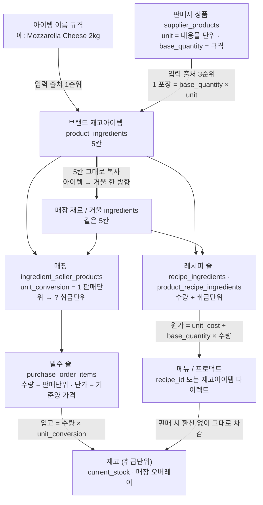

# 구입 · 판매 · 브랜드 구조 (정석)

> 이 문서가 **단일 기준**이다. 발주·원가·재고 관련 판단은 여기부터 읽는다.
> 다른 문서(`PURCHASE_ORDER_SYSTEM.md` 등)는 작업 기록이고, 구조가 궁금하면 이 문서를 본다.
> 최초 작성 2026-09-04. 내용은 Irene 이 정의한 구조 그대로이며, 임의로 고치지 않는다.

---

## 1. 정석 — 세 줄

1. **UGS → GIT**: UGS 는 GIT 의 공급업체다. GIT 가 UGS 물건을 자기 프로덕트로 등록하면 **재판매**이고, GIT 의 원가 = UGS 가격이다.
2. **K-소스 → GIT 이 직접 만든다**: 프로덕트에만 있고, 거기 **프로덕트 레시피**가 붙고, 레시피가 재료를 가리키고, 그 재료가 GIT 재고이고, 재고가 공급업체와 연결된다. GIT 의 원가 = 레시피 재료비 합계.
3. **GIT → 매장(K-DINE IPC · with MIN Cafe …)**: 위 어느 경우든 **매장에게 공급업체는 GIT** 이다. **매장 원가 = GIT 판매가.** 끝.

> **적용 조건 = GIT 프로덕트가 있을 때** (2026-09-11 실측·Fable 판정). GIT 가 팔지 않는 물건이면 3번이 걸리지 않는다 —
> 브랜드가 등록해 준 외부 공급업체를 **매장이 상속받아 직접 발주**하는 것이 설계된 경로다(`docs/SUPPLIER_CONTRACT_SYSTEM.md §G` · `routes/supplier-directory.js:1203-1211`).
> 운영 실례: 컵·뚜껑은 UGS → GIT 프로덕트 185·186 → 매장(판매자 GIT) 로 이어지고, **티슈는 GIT 프로덕트가 없어 매장 10 이 IKEA 에 직접 발주**(PO-R10-20260828-003, 입고 완료)했다. 둘 다 정상이다.

> Irene 원문(2026-09-04): "UGS는 GIT 의 공급업체이고 이 상품을 프로덕트로 등록하면 K-DINE IPC나 위드민은 GIT가 공급업체지. …
> K소스 시리즈는 GIT가 직접 제조하는 제품이니까 그냥 프로덕트에만 있고 레시피가 있고 그게 재료가 연결되어 재료들이 재고이고 그게 공급업체랑 연결된거고.
> 레스토랑들에는 GIT가 공급업체인건 동일하지"

---

## 2. 가격은 어디에 사는가

**GIT 프로덕트 한 곳.** 그 화면의 `단가` 가 GIT 판매가이고, 그것이 매장의 원가다. 매장마다 따로 정하는 가격은 **없다.**

용어는 두 단어만 쓴다 — **원가 / 판매가**. 매입가 같은 제3의 단어를 새로 만들지 않는다.
(화면의 칸 이름 `단가` 는 **판매가**를 뜻한다 — 칸 이름일 뿐 개념은 판매가다.)

### 원가는 2경로뿐
- **재판매 프로덕트** → 공급업체(판매자)가 가진 가격이 그대로 원가.
- **레시피 있는 프로덕트** → 레시피 재료비 합계가 원가. 각 재료의 원가는 다시 위 1번으로 풀린다.

평균가·특정시점가 같은 정책 분기는 **없다.**

### 2-3. 누구의 원가가 어느 계산에 들어가는가 (2026-09-11 Fable 실측·판정)

> Irene: 「브랜드에서 체크하는 레시피 재료공급원가는 브랜드거야. 레스토랑 계산루트에는 레스토랑거 들어가는 거 구조화 제대로 된거지?」

**규칙 — 원가는 두 층이고, 계산하는 쪽이 자기 층을 읽는다.**
- **브랜드 층** = `ingredients.unit_cost`(브랜드 거울) / `product_ingredients.unit_cost`(재고아이템). 브랜드가 사는 값. 브랜드 레시피·프로덕트 레시피 계산은 이 층만 본다.
- **매장 층** = `restaurant_ingredient_costs(restaurant_id, ingredient_id).unit_cost` — 매장이 **실제로 산 값**. 매장이 하는 모든 계산은 이 층을 먼저 보고, 없을 때만 브랜드 층으로 폴백한다(초기값).

| 계산 루트 | 읽는 층 | 코드 | 판정 |
|---|---|---|---|
| 브랜드 레시피 저장 | 브랜드 | `recipes.js:246·354 resolveLineCost` | 정석 |
| BG 프로덕트 레시피 | 브랜드(재고아이템) | `product-recipes.js:159·233·323` | 정석 |
| 매장 자기 레시피 저장 | 매장 → 브랜드 폴백 | `recipes.js:616·716 withOverrideCost` | 정석 |
| 매장이 보는 브랜드 레시피 | 매장 → 브랜드 폴백 | `recipes.js:502~539 effective_ingredient_cost` | 정석 |
| 매장 프로덕트 레시피 | 매장 → 브랜드 폴백 | `product-recipe.js:20~32·106·495` | 정석 |

**매장 층에 쓰는 손 3개** — 수령(`purchaseOrderReceive.js`, 가중평균) · 수동(`ingredients.js:689·725`) · **대조 덮어쓰기**(PURCHASE_ORDER_SYSTEM §8-4 D-1). 이 셋 말고는 없다.

**전파 규칙 — 누가 일으켰는가로 갈린다.**
- **판매자 주도**(가입 공급업체가 자기 가격 변경 `supplier-products.js:816` · 브랜드 프로덕트 가격 변경) → 그 상품을 사는 **모든 구매자의 브랜드 층**으로 퍼진다. 판매자의 권리다.
- **구매자 주도**(대조 `cost-reconciliation.js` · 매장이 자기 외부 공급업체 가격 수정 `supplier-directory.js:1212`) → **구매자 소유 행만.** 매장이 브랜드 공유 재료를 자기 외부 공급업체에 매핑해 두고 가격을 고치면, 브랜드 층이 아니라 **매장 층**에 앉는다. `costSync.recomputeUnitCost` 가 `ctx.actor` 로 소유자를 대조한다(§8-4 D-3).
- ⛔ 구매자 주도 진입점이 `ctx.actor` 를 안 넘기면 그 문으로 크로스테넌트 쓰기가 생긴다(2026-09-11 실측: 매장 대조가 브랜드 거울 15→22). **진입점 목록**: `cost-reconciliation.js`(actor 있음) · `supplier-directory.js:1212`(**actor 없음 — 보완 대상**) · `product-ingredients.js:1060`(연결 시 `onlyIfZero`, 자기 재고아이템 — 해당 없음).

**검증 결과(2026-09-11 실측) → 규칙 보정.** 매장 자기 레시피 조회(`GET /restaurants/:rid/recipes`)는 매장 층을 안 붙이고, 화면은 `ingredients.unit_cost` 로 재계산한다. 그런데 **매장 소유 재료**(`owner_type='restaurant'`)는 `ingredients.unit_cost`(자기 행)와 `restaurant_ingredient_costs`(수령이 쓰는 행)가 **따로 있고 값이 다르다**(dev: Beef Brisket 45 vs 15.06 · Onion 3 vs 2.05). 같은 개념이 두 칸에 산 것이다.

**매장 층의 자리는 재료 소유자로 정해진다 — 칸은 하나다.**
- **매장 소유 재료** → `ingredients.unit_cost` 자체가 매장 층이다. 오버레이를 쓰지 않는다(그 행은 매장 것이라 겹쳐 쓸 이유가 없다).
- **브랜드 공유 재료** → `restaurant_ingredient_costs` 가 매장 층이다(여러 매장이 한 행을 보므로).
- 쓰는 손 3개(수령·대조·수동)는 **한 헬퍼** `writeStoreCost(restaurantId, ingredient, value)` 를 거쳐 위 규칙대로 갈라진다. 읽는 쪽은 `effectiveStoreCost(ingredient, overlay)` 하나 — 매장 소유면 자기 행, 공유면 오버레이 → 폴백 자기 행. 자기 레시피 GET 도 brand-recipes GET 처럼 `effective_cost` 를 붙인다(화면 `lineCost` 는 이미 `effective_cost ?? unit_cost` 라 서버가 붙이면 그대로 맞는다).
- 매장 소유 재료에 이미 앉아 있는 오버레이 행은 **읽지 않는다**(백필 없음 — 어느 쪽이 진짜인지 데이터로 못 가른다). 운영 건수는 `운영검증` 에서 세어 보고만.

### 2-1. 프로덕트는 둘 중 하나다 (2026-09-04 Irene 확정 · 이전 결정 대체)

> Irene 원문 ① **"프로덕트=재고아이템 or 프로덕트=레시피=재고아이템 이렇게야."**
> Irene 원문 ② **"그냥 재고아이템 바로 연결하는 건데. 그대로 메뉴이고 그대로가 프로덕트인데."**

- **프로덕트 = 재고아이템** — 프로덕트가 재고아이템 **하나**를 그대로 가리킨다.
  1개 팔면 그 재고아이템 1개가 빠진다. 원가 = 그 재고아이템 원가(= 공급업체 가격, §2 재판매).
  **수량·단위 환산 없음** — "그대로"다.
- **프로덕트 = 레시피 = 재고아이템** — 지금 레시피 그대로.
- **둘 중 하나만.** 둘 다 걸면 저장 거부(`LINK_EXCLUSIVE`). 둘 다 없으면 목록에 `Not linked` 로 보인다.
- 이름은 **재고아이템 다이렉트 / Stock Item (direct)**. 브랜드 프로덕트와 매장 메뉴가 **같은 화면**이다.
- 매장 메뉴도 같은 규칙 — 메뉴 = 재고아이템 또는 메뉴 = 레시피 = 재고아이템.

⛔ **세 번째 길을 만들지 말 것.** 실제 사고: `Ingredients (direct)` 가 이름만 다이렉트였고,
실체는 재료를 여러 줄·수량까지 받아 `"<이름> (auto)"` 레시피를 몰래 만들어 붙이는 것이었다
(`routes/menu.js` · `routes/brand-products.js`). 화면에선 레시피가 아닌 척 숨겼다.
= 레시피에 이름표만 바꿔 단 것이고, "둘 중 하나"에 없는 길이었다.

**재료 0줄 레시피는 자동으로 끊지 않는다.** 사람이 걸어둔 미완성 레시피일 수 있고,
조용히 상태를 바꾸는 것은 위에서 없앤 "세 번째 길"과 같은 종류다. 대신 **ING-UNI-010** 이
"연결돼 보이는데 차감 0"인 행을 목록으로 드러낸다(비차단). 연결은 사람이 화면에서 한다.

**자동 강제:** 인스펙션 `ingredient-unification` — 008(레시피 FK 와 재고아이템 FK 동시 보유 0건) ·
009(` (auto)` 이름 레시피 0건)가 배포 게이트에서 fail-closed. 010 은 비차단 목록.

---

### 2-2. 단위 모델 — 다섯 칸 (2026-09-05 Irene 확정)

> Irene 원문 ① **"2kg가 1 pack인데 발주하는 기본 단위랑 레시피에 사용하는 단위랑 다르면 어떻게 해?"**
> Irene 원문 ② **"취급 기준숫자(Base Qty), 취급단위(unit), 기준양, 기준단위, 가격 이렇게 있어야 하는 거야. 가격은 기준양의 가격이고"**
> Irene 원문 ③ **"기준양의 가격은 발주기준이야."**
> Irene 원문 ④ **"포장단위가 우리가 말하는 기준단위야. … 취급단위라고 하는 unit이 우리 내부 사용단위 맞지?"**

**한 줄:** `1 pack(기준단위) = 2000 g(취급단위) = RM 93(가격, 발주 단가)`

| 한글 (정식 명칭) | 영어 라벨 | DB 칸 | 치즈 예 | 뜻 |
|---|---|---|---|---|
| **취급단위** | Usage Unit | `unit` | `g` | **우리 내부 사용단위.** 레시피·재고·차감이 전부 이 단위 |
| **취급 기준숫자** | Base Qty | `base_quantity` | `2000` | **기준양 전체에 든 취급단위 양 = 가격이 사는 양** |
| **기준단위(포장)** | Package Unit | `package_unit` | `pack` | 포장·발주 단위 |
| **기준양** | Package Qty | `package_quantity` | `1` | 가격이 가리키는 포장 수(보통 1) |
| **가격** | Price / Package | `unit_cost` | `93` | 기준양의 가격 = **발주 단가** |

**항등식:** `base_quantity × 취급단위 = package_quantity × 기준단위 = unit_cost 가 가리키는 것`
치즈 → `2000 g = 1 pack = RM 93`.

> **기준양이 1 이 아닌 경우** (운영 사례 없음, 정의용): 6병 묶음으로 가격이 붙는 음료 —
> 기준단위 `bottle` · 기준양 `6` · 취급단위 `ml` · 취급 기준숫자 `1980`(= 6 × 330) · 가격 `RM 12`(6병 값).
> ml 당 원가 = 12 ÷ 1980. 병당 용량은 1980 ÷ 6 = 330 ml 로 **계산**한다(저장하지 않는다).

**파생값 — 따로 저장하지 않는다. 계산해서 나온다.**
- 취급단위당 원가 = `unit_cost ÷ base_quantity` = 93 ÷ 2000 = **RM 0.0465 / g**
- 레시피 줄 원가 = 취급단위당 원가 × 줄 수량 → `40 g` = **RM 1.86**
- 재고 표기 = 취급단위 + 괄호 환산 → `5,920 g (2.96 pack)`

**이 다섯 칸은 세 표가 똑같이 갖는다** — 브랜드 재고아이템(`product_ingredients`) · 매장 재료(`ingredients`) · 거울(= 재고아이템을 브랜드에 공유한 `ingredients` 행). 거울은 아이템에서 **다섯 칸 그대로 복사**되며 방향은 아이템 → 거울 한 방향뿐(§`INGREDIENT_UNIFICATION_DESIGN.md` F2).

#### 어디서 무슨 단위를 쓰는가

- **레시피는 취급단위만 쓴다.** `40 g`. 포장을 모른다.
- **발주는 판매자 단위로 센다.** `3 pack`. 매핑 `ingredient_seller_products.unit_conversion` = **"1 판매단위 = ? 취급단위"** (치즈 2000). 입고 = `수량 × unit_conversion` 취급단위 = +6000 g.
  - **발주 줄 단가는 그 판매자 매핑의 `unit_price`** — 판매자마다 값이 다를 수 있고 실제 PO 는 매핑 가격을 쓴다. 아이템 `unit_cost` 는 **원가 계산의 기준양 가격**이며 발주 기준으로 적는다(§2 원가 2경로).
  - **환산 기본값** = 판매단위가 기준단위와 같으면 `unit_conversion = base_quantity ÷ package_quantity` (치즈 2000). 그 판매자가 다른 포장으로 팔면(1 kg 봉지) 그 매핑만 1000.
  - **발주 줄에 찍히는 단위 라벨은 서버가 정한다** (2026-09-07). `purchase-orders-crud.js` 의 `resolveOrderUnit`:
    **판매자 상품 단위 → 없으면 구매자 재료의 `package_unit` → 없으면 취급단위**. 화면이 보내는 값은 쓰지 않는다.
    그전에는 `raw.unit || ing.unit` 이라 **취급단위(g)** 가 그대로 찍혀, 1kg 들이 소스를 2개 주문한 줄이
    `2 g · RM32.90` 으로 보였다(수량·금액은 내내 맞았고 라벨만 틀렸다). 발주 담는 화면도 같은 규칙(`orderUnitOf`)을 쓴다.
    ⛔ 이걸 데이터로 고치려 들지 말 것 — 아래 "취급단위는 바꿀 수 없다" 가 그 이유다.
  - **판매 상품·발주 줄도 다섯 칸을 따른다** (2026-09-11 Fable 판정 · Irene 「권고대로 해」).
    Irene 원문: 「발주할 때 기본용량 포장단위가 있고 거기에 수량이 올라가는 거잖아. 수량에 포장단위가 붙는거고.」
    - 판매 상품 3표(`supplier_products`·`brand_products`·`foodcourt_products`): `unit`=취급단위(내용물 kg) · `base_quantity`=취급 기준숫자(10) · **`package_unit`=기준단위(포장, BOX)** — 자유 문자열(인보이스 UOM 그대로). 기준양은 판매 상품에서 항상 1 이라 칸이 없다.
    - 발주 줄 `purchase_order_items`: `unit`=포장단위(BOX) · **`base_quantity`·`base_unit`=주문 시점 용량 스냅샷**(10 / kg). 판매자가 나중에 규격을 바꿔도 지난 발주서·대조가 흔들리지 않는다.
    - 표시: `Kimchi · 10 kg/BOX · × 3 BOX @ 48.00 = 144.00`. 규칙 단일 소스 = 서버 `utils/poLineSpec.js` · 화면 `utils/unitConversion.ts`(`sellerOrderUnitOf`·`sellerSpecText`·`lineSpecText`).
    - 줄 단위 순서: 포장단위 → (용량 ≠ 1 이면) `pack` → 판매자 내용물 단위 → 구매자 재고행 단위. 무게 주문(measure)은 내용물 단위 자체.
      ⚠ 구매자 재고행 단위를 판매자 내용물 단위 **앞에 두지 않는다** — 재고행 `package_unit` 에 취급단위(g)가 복사돼 있는 경우가 대부분이라(dev 실측) 9/7 에 고친 «2 g» 가 되살아난다.
    - 같은 날 결함: 옛 `resolveOrderUnit` 이 supplier 상품을 매장 메뉴 표(`products`)에서 찾아, 번호가 겹치면 `stock_unit` 기본값 `piece` 가 찍혔다(운영 `Kimchi × 2 piece`). 판매자 종류 → 판매 상품 표 매핑으로 수정.
    - 이행 `scripts/migrate-seller-package-unit.js`(멱등): `unit` 에 pack/piece/bottle/can 이 있고 `base_quantity`=1 인 판매 상품만 **빈 `package_unit` 에** 복사. `unit` 무접촉.
  - **판매 상품 규격 표기·어휘** (2026-09-11 Fable 설계 · Irene 「fable 권고대로」 확정 — 5·6칸=예전 값·마지막 칸 저장 / 공급업체 문서 영문만 / 포장단위 풀네임 통일 / 가격 목록 기준 덮어쓰기(빈 칸 유지))
    Irene 원문: 「영문(한글) 이렇게 이름 좀 다 맞춰줘. 단위도 여기 표시되는 거 포장단위야. … 모든 곳에 포장기준단위 표시가 각각 따로 있어서 헷갈리는데 붙여두고 알기 쉽게 좀 안돼? 1kg/pack 이런식으로, 그리고 수량을 1pack, 2pack, 이렇게 올리는 거지.」
    - **새 칸·새 표 없음.** 위 세 칸(`unit`·`base_quantity`·`package_unit`)을 **한 줄로 붙여 보여줄 뿐**이다 — 규격 `1 kg/pack`, 수량 `× 2 pack`. 표시 함수는 이미 있다(서버 `poLineSpec.js` · 화면 `unitConversion.ts` `sellerSpecText`/`lineSpecText`). 결함은 화면마다 칸을 따로 보여주는 것과, 폼의 취급단위 선택지에 포장단위(pack·can·bottle·box·carton)가 섞인 것(`SupplierProductsTab.tsx` UNIT_OPTIONS).
    - **이름** (Irene 추가 지시로 교체, 2026-09-11): 판매 상품 `name` = **공급업체가 부르는 이름(영문)**. Irene 「아이템명은 공급업체쪽에는 영어만 표시되면 돼. 발주할 때도, New Seoul Mart 만 영어(한글) 그대로 해줘.」「원래 공급업체 아이템 이름이랑 우리 재고아이템 이름 달라.」「DB 항목 다 있어」 — 한글은 우리 재고아이템 이름(`ingredients.name`·`product_ingredients.name`)에 이미 있다. **예외: New Seoul Mart 만 «English (한글)»** (해석기 옵션 `koreanNameSellers` · CLI `--korean-name-sellers`, 새 칸·설정 없음). 영문명은 `invoice_name` 빈 칸에도(대조 자동매칭 칸). 공급업체에게 나가는 문서(WhatsApp·PDF·인쇄·메일·수신)는 **판매 상품 이름을 저장된 그대로** 쓰고, 연결 없는 줄에 대신 나가는 우리 재고 이름만 끝의 한글 괄호를 뗀다(`supplierFacingName`). 우리 내부명 «Buyer ref» 는 싣지 않는다.
    - **포장단위 저장 어휘**: pkt·pck·pack→`pack` · btl→`bottle` · ea·pc·pcs→`piece` · ct·ctn→`carton` · 매→`sheet` · tub·tin·drum·roll·bundle·tray·box·can·bag 그대로. 제안 목록 `PACKAGE_UNIT_SUGGESTIONS` 에 tub·drum·roll·bundle·sheet 추가. **취급단위 선택지는 kg·g·L·ml·piece 만.**
    - **표기 해석**: `1kg/pkt`→1 kg / pack · `50ea/box`→50 piece / box · `1btl/1L`→1 L / bottle · `500g` 단독→500 g / pack · `1btl` 처럼 **용량 미상 → 취급단위 `piece` · 용량 1 · 포장단위 = 그 포장 이름**(표시는 «1 bottle» 로 접힘, 검토표 «용량 미상» — Irene 「fable 권고대로 해」 2026-09-11 확정. 레시피에 ml/g 로 쓸 식재료는 Irene 이 용량을 채우면 그때 바뀐다) · 무게로 사는 업체(TaiYang·De Green·Guan Kee·Lee's·Nikudo·NSK)의 `1kg` → 무게 주문(measure).
      (처음 설계의 «내용물 미상 → 취급단위=포장단위» 는 Irene 추가 원칙에 따라 Fable 이 폐기 — 취급단위 칸에 포장 이름을 넣지 않는다.) 해석기 단일 소스 `dev-backend/utils/catalogSpecParser.js`.
    - 반영 절차(검토표 → 확인필요 행만 Irene 답 → 백업·트랜잭션 1개·재조회)는 `docs/EXTERNAL_SUPPLIER_PRODUCTS.md` §11.
    - Irene 추가 원문(같은 날, 구현 중): 「레시피나 재고관리에 사용하는 단위는 포장 기준수량에 사용하는 단위와 같아야 해. 그리고 포장단위가 있는거야. 그러니까 레시피에서나 재고에서는 g이나 kg 등을 쓰고, 발주에서는 1kg/pack 이런식인거야. 그리고 이 정보면 모든 아이템 정보에 다 똑같이 나오게 하는 거고」 — **Fable 판정: 설계 변경 아님(§2-2 그대로의 확인).** ①용량 미상 규칙 교체(위) ②재료 카드·브랜드 재고아이템 카드의 자기 규격 줄도 같은 규격 함수(`unitConversion.ts` `stockSpecLabel`) ③**기존 재료·재고아이템 취급단위 pack→g/kg 수렴은 이번 범위 밖**(레시피 줄·재고·연결 환산을 한 트랜잭션에서 함께 바꿔야 하는 비가역 작업 — 상품 정리 → 수렴 후보 보고서(셈만) → 별도 설계 1회).
      운영 실측(SELECT): 매장 10 재료 385 중 `unit` 포장 이름 212(레시피 줄 0) · 브랜드 거울 brand 1 63/63 · brand 2 «K-DINE with MIN»(GIT Consulting · 실매장 8 «K-DINE IPC Branch») 163 중 81 · 브랜드 재고아이템 321 중 193(레시피 줄 55/74 가 여기에).
- **판매 차감은 환산하지 않는다.** `inventoryDeductionService.js` 가 레시피 줄 수량을 그대로 뺀다 — 그래서 **"레시피 줄 단위 = 재료 취급단위"가 불변식**이고, 인스펙션 `ING-UNI-011/012` 가 이걸 지킨다.
- **재고는 어디서나 취급단위로 센다.** 브랜드 창고도 g. 화면이 괄호로 포장 환산을 같이 보여준다.
- **취급단위는 레시피 줄이 하나라도 붙어 있으면 바꿀 수 없다** — `UNIT_LOCKED_BY_RECIPES` 409, 브랜드·매장 공통. 바꾸려면 **줄 수량·재고·매핑 환산을 같은 트랜잭션에서 함께 환산**한다(P1 수렴 스크립트, 이후 P2 화면). 바꾸는 순간 `20 g` 이 `20 pack` 이 되기 때문이고, 이것이 Irene 이 화면에서 만난 에러의 자리다.

#### 관계도

**입력 출처 우선순위:** 이름 규격 > 거울이 이미 가진 값 > 판매자 상품 규격 > 취급 값 복사(기준 = 취급).

#### 지금 틀린 자리 (2026-09-05 운영 실측)

**취급단위 칸에 기준단위 값이 앉아 있다.** 브랜드 재고아이템 310건 중 **254건**(pack 139·piece 85·bottle 25·can 5), 매장 재료 404건 중 **301건**이 `unit` 에 포장단위를, `base_quantity` 에 1 을 넣고 등록돼 있다. 그래서 `Mozzarella Cheese 2kg` 는 **어디에도 2000 이 기록돼 있지 않고**, 레시피에 `0.02 pack` 으로 들어가 있다.

- 브랜드 쪽은 거울이 옛 모델(`g / 1000`, `kg / 5`)을 그대로 갖고 있어 **레시피 302줄은 지금도 맞게 돈다** — 어긋난 아이템 18건.
- 매장 쪽은 아예 비어 있으나 **레시피 줄이 13줄뿐이라 아직 안 터졌다.** 이름 59건·판매자 규격 81종에 답이 적혀 있다.
- 공급업체 화면만 처음부터 옳게 안내하고 있었다 — `ko/supplier.json` **"Unit 에는 내용물 단위(kg·g), Base Qty 에는 그 양(예: 5)을 넣으세요"**. 즉 판매자 상품의 두 칸은 이미 취급단위/취급 기준숫자다.

⛔ **같은 개념에 다른 말을 쓰지 말 것.** 화면마다 "기본 수량"·"기준 수량"·"Base Qty / Unit" 이 섞여 있던 것이 혼동의 절반이었다. 위 표의 다섯 이름만 쓴다.

---

### 2-4. 판매 상품의 «종류» — 셋이다 (2026-09-13 Irene 확정 · 운영 SW 5.19)

> Irene 원문 ① **「주문제작 설정을 해. 재고 있고 없고랑 상관없이 주문할 수 있게.」**
> Irene 원문 ② **「주문제작 (재고관리 안함, 배송처리 함), 서비스/기타 (재고관리 안함, 배송처리 안함 … 이렇게 나눠져야 하는 거 아니야? 서비스는 그냥 바로 완료가 되어야 해서 배송일이 아니라 완료일 이름만 다르면 될 것 같은데.」**

`brand_products.product_kind ENUM('stock','made_to_order','service')` — 기본값 `stock`(종전 동작).
**«재고를 세는가»와 «배송이 있는가»는 서로 다른 축이라 참/거짓 하나로 담지 않는다.**

| 종류 | 재고 | 배송 | 예 |
|---|---|---|---|
| `stock` 재고 상품 | 센다 | 한다 | 포장·완제품 |
| `made_to_order` 주문제작 | 안 센다 | 한다 | 주문받아 만드는 소스 |
| `service` 서비스·기타 | 안 센다 | **없다** | 컨설팅 시간 |

- **차감**: `stock` 이 아니면 출고에서 **자체 재고를 건드리지 않는다**(`routes/seller-orders.js` 자체재고 분기 앞 `continue`). 레시피·재고아이템이 걸린 상품은 종류와 무관하게 §2-1 규칙대로 구성재료가 빠진다.
- **이행**: 서비스만 담긴 발주는 배송·도착·입고를 건너뛰고 `POST /api/seller-orders/:id/complete` 한 번으로 `received` 가 된다. **물건 줄이 하나라도 섞이면 배송 있는 주문**이다 — 판정은 `utils/orderFulfillment.isServiceOnlyOrder` **한 곳**이고, 화면·라우트에 복사하지 않는다(`is_service_only` 로 내려준다). 새 상태값은 만들지 않았다.
- **단위**: `service` 일 때만 취급단위 선택지에 `hour` 가 붙는다. 매장 재고 단위 ENUM 8개에는 없는 값이라 재고로 넘어갈 수 없다(§2-2 여섯 칸 무접촉).
- **시간을 파는 상품 넣는 법**: 「4시간 기본, 1개 신청 = 4시간」 → 주문방식 «개수로» · 취급단위 `hour` · 기준양 `4` · 포장단위 `ea` → 규격 «4 hour/ea». 포장단위를 비우면 `sellerOrderUnitOf` 가 `pack` 으로 떨어져 «4 hour/pack» 이 된다.
- ⛔ `track_stock` 을 게이트로 되살리지 않는다 — 2026-09-01(Q5)에 일부러 뺀 폐기 스위치다.

### 2-5. 마진은 «판매 단위» 기준으로 — 단위 환산이 먼저다 (2026-09-20 Irene 신고 2건)

> Irene ① 「김치가 우리 공급가가 48링깃이지? 10kg 1박스에. 이거 우리 프로덕트 판매는 1kg 기준이거든 … 마진이 −540%로 나와」
> Irene ② 「Sawah Mas … We sell 10 kg/pack · RM 43.00 / We buy 10 kg/pack · RM 34.50 / Margin RM 0.00 → RM 4.30 / kg (+124537.7%)」

`unit_cost` 는 **1단위 값이 아니라 `base_quantity` 만큼의 값**이다(§2-2 항등식). 그걸 판매가에서 그냥 빼면
10,000g 한 박스 값을 1kg 값과 비교하게 된다 — 위 두 신고가 모두 그 하나의 실수다(2026-09-11 ×1000 사고와 같은 뿌리).

**계산 두 줄 (화면 단일 소스 `dev-frontend/src/utils/productMargin.ts`):**
1. 1단위 원가 = `unit_cost ÷ base_quantity` (재고아이템·레시피 동일. 레시피는 `total_ingredient_cost ÷ yield_amount`)
2. 프로덕트 원가 = 1단위 원가 × `convertUnit(프로덕트 base_quantity, 프로덕트 unit → 원가 쪽 unit)`

- 김치: (48 ÷ 10000) × 1000 g = **RM 4.80** → 판매 7.50 → 마진 RM 2.70 (36%)
- Sawah Mas: (34.50 ÷ 10000) × 10000 g = **RM 34.50** → 판매 43.00 → 마진 RM 8.50 (20%)
- 공급 연결에서 읽을 때 `unit_conversion` 으로 나눈 값(`unit_price ÷ unit_conversion`)은 **우리 재고 단위 하나** 값이다 — 판매 단위와 다르면 그대로 쓰지 말 것.

⛔ **화면마다 제 계산을 두지 않는다.** 목록 카드와 편집창이 따로 계산해서 ②가 하루 더 살아남았다.
⛔ **바꿀 수 없는 단위 조합(kg ↔ piece)은 숫자를 지어내지 않고 「단위 환산 불가」로 둔다** (운영 6건).

회귀 박제: `dev-frontend/src/utils/productMargin.test.ts` 5건(환산을 빼면 4건 실패). 단, 화면 jest 는 배포 게이트 밖이라 직접 돌려야 한다.

---

---

## 3. "재료"가 두 군데인 이유 — 주방이 둘이다

같은 "재료"라는 말을 쓰지만 **주인이 다르다.**

| 화면 | 무엇인가 | 누가 쓰는가 |
|---|---|---|
| **Stock Items** | **GIT 공장의 재고** — UGS 등에서 사오는 포장재·원재료 | **프로덕트 레시피**(K-소스 제조)가 소비한다 |
| **Shared Ingredients** | **K-DINE 매장 주방의 재료** — 매장이 사서 쓰는 것 | **브랜드 레시피**(매장 메뉴)가 쓰고, 매장이 **발주**한다 |

- K-Jjamppong Sauce 가 Shared Ingredients 에 있는 것은 **매장이 사서 쓰는 재료**이기 때문이다.
- Stock Items 에 넣은 것은 브랜드 레시피 재료 목록에 **나오지 않는다.** 두 목록은 서로 참조하지 않는다.
- 이건 개념이 둘이어서가 아니라 **구현이 따로 지어졌기 때문**이다(§5-2 참조). 개념은 하나다 — 재고 아이템 = 재료, 주인이 누구냐만 다르다.

### 레시피도 두 계통이다 (섞지 말 것)
- **프로덕트 레시피** — GIT 프로덕트가 무엇으로 만들어지는가. GIT 재고(Stock Items)를 소비한다.
- **브랜드 레시피** — 매장 메뉴가 무엇으로 만들어지는가. 매장 재료(Shared Ingredients)를 소비한다.

---

## 4. 매장이 GIT 물건을 사는 흐름

**정석:** GIT 프로덕트 → 매장 발주 → 입고 → 재고 증가.

발주서에 찍히는 값은 **GIT 판매가**여야 한다.

지금 구현은 그 사이에 "매장이 그 물건을 자기 재료 목록에 올리는" 단계가 하나 더 끼어 있다 → §5-1.

---

## 5. 지금 구현이 정석과 다른 곳

정석대로 되어 있지 않은 지점들이다. 발주·원가에서 이상한 숫자를 보면 먼저 이 목록을 의심한다.

> **재료 카테고리 — 브랜드 소유 벌은 쓰기 중단(write-stop)** (2026-09-17 Fable 판정 ⑧).
> 매장이 보는 재료 카테고리의 정본은 **매장 소유 한 벌**이다. 브랜드 소유 `ingredient_categories` 행은
> 2026-07-05 폐기된 프로덕트→재료 미러의 잔재라 새로 만들지 않는다(브랜드 쪽 «진짜» 분류는
> `product_ingredient_categories` = Stock Items 쪽에 따로 있다). 재발 방지는 인스펙션 **ING-UNI-026**.
>
> **재료의 출처는 셋 중 정확히 하나** (2026-09-17 Fable 판정 «준비된 재고»).
> 사는 것 = Stock Item(`source_product_ingredient_id`) · 파는 것 = 브랜드 프로덕트(`source_brand_product_id`) ·
> **만드는 것 = 레시피(`source_recipe_id`)**. 세 번째는 «준비된 재고»(1차 가공)가 앉는 자리이고,
> 새 표가 아니라 `ingredients` 의 한 행이다. 차감은 **만들 때 한 번**(생산 기록)이고 판매 시엔 준비 재료만 빠진다.
> 검사는 ING-UNI-027(출처 겸함 0) · 028(단위=수율 단위) · 029(메뉴 연결 0) · 030(중첩 0).

### 5-1. 매장마다 가격 복사본이 따로 산다 — **해결됨**(2026-09-06, v3.86)
매장이 GIT 물건을 자기 재료 목록에 올리는 순간 **GIT 가격이 매장 쪽에 숫자로 복사**됐고, 발주서가 그 복사본을 읽었다.
그래서 GIT 가 가격을 바꿔도 매장 쪽은 따라가지 않았다.

- **지금은 판매자 현재가를 따라간다.** `costSync` 가 사본이 아니라 **판매자 현재가**를 읽고 사본도 함께 갱신한다(발주는 그 값을 읽는다).
  원가는 **재고아이템 → 브랜드 재료(거울) → 레시피**까지 전파된다(`unit_cost`, 0 은 "미정"이라 전파 제외).
  거울 화면에서는 원가를 직접 못 고친다 — **원본(재고아이템)에서 고치면 따라온다.** 매장별 조정은 원래 자리(레시피 원가 오버라이드) 그대로.
- 운영 정정 실측(2026-09-06 배포 전 → 후): 공급업체 매핑가 ≠ 상품 현재가 **57 → 0** · 브랜드 프로덕트 드리프트 **20 → 0** · 거울 원가 불일치 **2 → 0** · 원가 0 인 활성 재고아이템 **248 → 95**.
- 옛 사례(참고): K-DINE IPC 에 옛 가격이 굳어 있던 7건 14칸(2026-09-04 정정) · with MIN Cafe 는 아예 다른 행(§5-2)에 붙어 있었다.
- 남은 것: **원가 출처가 없는 재고아이템 5건**과 **가격 0 인 소모품 프로덕트 20건** — 데이터로 정할 수 없어 화면에서 넣어야 한다.

### 5-2. 재료 테이블이 둘, 카테고리 테이블이 셋
- 재료: GIT 재고(Stock Items)와 매장 재료(Shared Ingredients)가 **다른 테이블**이고, 둘을 잇는 장치는 읽기만 따르고 쓰기는 무시한다.
- 카테고리: 재료용·GIT 재고용·옛 잔재용으로 **세 벌**이 따로 있다.
- Stock Items 카테고리 안의 중복 4건(빈 3건 삭제 · `MEAT`→`Meat` 개명) — **2026-09-04 정리 완료**(남은 18건, 중복 없음).
- **해결됨 (2026-09-04, SW 4.78)** — Stock Items 로 통합 완료. 재료를 만드는 길은 하나이고, 매장 재료 행은 그 거울이다.
  출처는 둘 중 하나 — GIT 이 **사는 것**=Stock Item / **파는 것**(프로덕트)=프로덕트 자체가 재고.
  설계·증명 = `docs/INGREDIENT_UNIFICATION_DESIGN.md`.
  ⚠ **관리자 화면 몫으로 남긴 것**: 재고아이템 안 같은 물질 7건(소주 3종·밥그릇 L/M/S·뚜껑 큰/작은·김치 할랄/포기·깐마늘·호떡·봉투 L/XL) ·
  K-소스 이름 3건(K-Soy·K-Yukgaejang·K-Kimchi — 긴 이름 후보가 둘씩) · 303 깐마늘·157 호떡 환산비.
  전부 **데이터로 못 정해 손대지 않은 것**이고, Stock Items 화면에서 이름을 고치면 브랜드 쪽에 따라간다.

### 5-3. GIT 판매상품에 같은 물건이 두 줄씩 있었다 — **해결됨**(2026-09-04)
UGS 상품이 GIT 판매상품 자리에 매입가 그대로 복사된 행(`SP-*`)이 50건 있고, with MIN Cafe 가 **전부 그쪽에 물려 있다**(그 값으로 나간 발주 1건이 입고 완료).
GIT 프로덕트(`PRD-*`)로 **이관 완료**(연결 50건·92칸, 중복행 50건 비활성, 증명 50/50 · SP 잔여 0).
- 뿌리: 2026-08-28 사고(공급업체 원가를 판매가 자리에 복사).
- **재발 방지:** 공급업체 상품을 자기 판매상품으로 등록하는 정식 화면이 없어 스크립트로 때운 것이 원인이다. 화면이 생기기 전까지 같은 작업은 반드시 드라이런 → 검토 → 승인 순서로.

### 5-4. 포장 단위 표기가 케이스와 봉지로 섞여 있다 — **해결 예정**(2026-09-11 설계, §2-2 «판매 상품 규격 표기·어휘»)
공급업체 쪽 이름은 케이스 표기(`50PCS X 12PKTS`), GIT 쪽은 봉지 표기(`50PCS/PKT`)인데 환산비는 1.0 이다.
숫자를 옮기기 전에 **두 값의 단위가 같은지 먼저 확인한다.** 팩당 개수를 안 곱해 50배 틀린 사고가 있었다.

**단위 자체의 정의는 §2-2 "단위 모델 — 다섯 칸" 이 단일 기준이다.** 케이스·봉지가 섞여 보이는 것은 대개 **취급단위 칸에 기준단위(포장) 값이 들어가 있는 것**이다 — 먼저 §2-2 에 대조한다.

### 5-5. 판매가가 정해지지 않은 GIT 프로덕트가 있다
프로덕트는 등록됐는데 `단가` 가 0 인 것들이 있다. **0 = "아직 정하지 않음"** 이고, 0 인 채로 매장에 내려보내면 금액 0 짜리 발주가 나간다.
- 규칙: 가격을 옮길 때 **0 은 "결정 없음"으로 취급해 덮어쓰지 않는다.** 지금 값을 유지하고, Irene 이 정하면 그때 맞춘다.
- 실측(2026-09-04): 판매가 0 인 GIT 프로덕트 **36건**, 그중 with MIN 이 실제로 사는 것 **28건**(Irene 입력 대기).

### 5-6. `general_stock_categories` 잔재
소문자 이름 3건이 남아 있고 참조는 거래 테이블 하나뿐이다. 옛 흔적으로 보이며 지금은 손대지 않는다.

### 5-7. 프로덕트 자체 재고(`current_stock`)는 정석 밖

`products.current_stock` / `brand_products.current_stock` — 프로덕트 행 **자체에 수량을 두는** 경로가
2026-08-22·09-01 에 따로 지어져 있다. 팔리면 거기서 빼고 발주도 거기로 들어온다.
**재고아이템 목록에는 안 나오는 숨은 재고**다. 그래서 dev 에 `PEACH BASE` 가
프로덕트(PRD-035)와 재고아이템(PI-005) 두 줄로 있고 서로 모른다.

- 실측(dev, 2026-09-04): 이 경로에 **수량이 있는 행 0건**(브랜드 32 · 매장 88 전부 0). **운영은 미측정.**
- 이번 라운드는 **무접촉**이다 — 운영에 배포된 경로라 운영 수치를 먼저 재야 한다.
- 대신 **다이렉트 연결이 있으면 그쪽이 우선**이고, 다이렉트 연결된 프로덕트는 **발주 줄로 사는 것을 막는다**
  (레시피 프로덕트와 같은 규칙 — 재고아이템을 사라).
- 자동으로 재고아이템을 만들어 붙이지 않는다. 연결은 Irene 이 화면에서 한다.

---

### 5-8. 공급업체 상품 목록에 상한이 있다 — **해결됨**(2026-09-06, v3.86)
카탈로그가 **최신 200개까지만** 내려와 그 아래가 조용히 잘렸다. Lee's Fandbee 상품이 검색에 안 나오던 것의 확정 원인이다
(289건 중 89건이 잘렸고 Lee's 5건은 219~283위였다). 상한을 **2,000** 으로 올리고, 또 잘리면 화면에 `전체 N개 중 M개만 불러왔습니다` 가 뜬다(`meta.truncated`).
- 남은 것: 검색을 **서버에서** 하도록 바꾸는 정식 수정(지금은 전량을 받아 브라우저에서 거른다).

### 5-9. 코드 채번이 건수 기반이었다 — **해결됨**(2026-09-06, v3.86)
상품 SKU·재고 코드가 `count + 1` 이라 **행을 지우고 새로 만들면 이미 쓰인 번호가 다시 나왔다**(운영에 중복 12종).
**원자 카운터**로 바꿔 빈칸 없음 · 번호 재사용 없음 · 동시 발급 충돌 없음 · 수기 중복은 409 로 막는다.
- ⚠ **백필은 하지 않았다**(Irene 지시 "체계만"). 이미 중복인 옛 코드는 그대로 남아 있다.

### 5-10. Brand Manager 가 자기 브랜드를 못 보는 자리가 남아 있다
역할 검사는 Brand Manager 를 통과시키는데 그 다음 `owner_id` 로 걸러 **항상 빈 결과 또는 403** 이 되는 곳이 여럿이다.
- 2026-09-06 에 **매장 목록 1곳**은 고쳤다(형제 조건식, 남의 브랜드는 그대로 403).
- ⛔ 남은 곳을 그냥 넓히면 안 된다 — `GET /api/brands` 목록은 Brand 행을 통째로 돌려주어 **결제 설정(Stripe/PayPal)·은행 계좌·구독 금액**까지 함께 나간다.
  형제 라우트 `payment-settings` 는 같은 값을 Brand Manager 에게 **일부러 403** 으로 막는다. 넓히는 순간 그 돈 경계가 뚫린다.
- 정식 수정은 **안전한 투영만**(id·name·code·logo·restaurants) 주는 형태이고, `brands?owner=me` 호출부 전수 조사가 선행돼야 한다. **별건 설계 대상.**

### 5-11. 단위 수렴이 처리 못 하는 값은 사람 몫으로 남는다 (2026-09-06)
`§2-2` 다섯 칸을 채우는 수렴 스크립트는 **곱셈 결과가 컬럼 표현 범위를 넘으면 그 행을 건드리지 않고 목록에 올린다.**
컬럼을 넓히거나 값을 자르지 않는다 — 그건 잘못된 값을 합법화하는 것이기 때문이다.
- 실제 사례: 매장 10 `Cockle Meat(Blood Clam)` 의 공급업체 매핑 3건이 `unit_conversion = 250,000`("판매 1팩 = 취급 25만 팩" — 오염값)이고,
  판매자 규격(500 g/팩)을 적용하며 500 을 곱해 **1.25e8** 이 되어 `DECIMAL(10,4)` 상한(999,999.9999)을 넘었다. 그 한 행이 **모든 매장의 배포를 세웠다.**
- 검산 대상은 셋이다 — 매핑 `unit_conversion` · 레시피 줄 `quantity`(둘 다 DECIMAL(10,4)) · 재고 `current_stock`(DECIMAL(10,2)).
- **사람이 정해야 하는 것**으로 표시된 행은 재료·레시피 줄·매핑·재고 **전부 무접촉**이다(2026-09-06 이전에는 줄·매핑만 환산되어 재료는 팩인데 줄만 g 로 갈라지는 길이 있었다).
- 운영 현황: 사람 몫 **54건**(대부분 "이름 규격이 애매" · 비식품 제외). 목록은 배포 로그와 인스펙션 013 에 계속 뜬다.

### 5-12. 판매자 자체 재고의 «재고 단위» 칸 — **Fable 판정 대기 (2026-09-13 접수 · 착수 금지)**

**Irene 원문(2026-09-13):** 「프로덕트 상세에 재고관리에 단위를 왜 또 따로 넣어? 여기서 선택하면 그 기준으로 베이스 유닛 단위가 맞춰져야 하는 거 아니야? 아니면 패키지 단위? 이거 어떻게 되는거야? 이것도 중요하니까 fable 에게 남겨두자.」
(가리키는 화면 = 브랜드 상품 상세의 «Stock for this product / Sold as-is (no recipe) — this product itself is the stock / 0 / Unit (e.g. carton, box)» — `BrandProductsTab.tsx:1173-1190`)

**팀원 실측 (판정용 사실 · 고치지 않았다):**
1. `brand_products.stock_unit` 은 **환산에 쓰이지 않는다.** 모델 주석은 「재고 단위(판매 단위와 다를 수 있다)」인데(`models/BrandProduct.js:115`), 코드에서 쓰이는 곳은 **원장 줄의 라벨뿐**이다 — `routes/seller-orders.js:548`·`services/inventoryDeductionService.js:255,266,273`·`services/purchaseOrderReceive.js:51` 이 `inventory_transactions.unit` 에 적는다. 수량을 바꾸는 계산은 어디에도 없다.
2. **차감 산식은 `current_stock -= quantity_ordered`** 다(`routes/seller-orders.js:534-542`). `quantity_ordered` 는 **주문 단위**(개수로 주문이면 포장단위)다. 즉 자체 재고 숫자는 사실상 **포장단위로 세는 수**다 — «10 kg/BOX» 상품을 3 BOX 팔면 재고가 **3** 줄어든다(30 이 아니다).
3. 그래서 «재고 단위» 칸에 `kg` 을 적어도 숫자는 BOX 개수다. **칸과 숫자가 서로 다른 말을 할 수 있고, 아무것도 막지 않는다.**
4. 운영 실측(2026-09-13): 자체 재고 상품(레시피·재고아이템 없음) **81건 중 78건은 `stock_unit` 이 비어 있다.** 값이 있는 3건은 전부 `pack` 이고 `unit`·`package_unit` 과 같은 말이다 — **아무도 이 칸을 다르게 쓰고 있지 않다.**
5. 공급업체 쪽은 **칸 자체가 없다**(`supplier_products` 에 `stock_unit` 컬럼 없음). 같은 출고 코드가 원장 줄 라벨로 `sp.unit`(내용물 단위)을 적는다(`routes/seller-orders.js:474`) — 숫자는 주문 단위인데 라벨은 내용물 단위다.
6. 과거 사고 기록: 이 칸의 기본값 `piece` 가 **발주 줄에 찍힌 적이 있다**(`utils/poLineSpec.js:57` 주석 · dev 매핑 46건 중 23건).

**길이 갈린다 (팀원이 고르지 않는다 — 재고 숫자의 의미가 바뀌는 일이라 비가역):**
- **A.** 칸을 없애고 «자체 재고는 주문 단위(포장단위)로 센다»를 못 박는다. 라벨은 `package_unit` 에서 파생 — 화면에서 따로 묻지 않는다. (§2-2 다섯 칸과 같은 방향. 운영 78/81 이 이미 빈 칸이라 데이터 손실 없음.)
- **B.** 칸을 남기고 **환산을 실제로 구현한다** — 재고는 내용물 단위로 세고 출고 때 `quantity × base_quantity` 로 깎는다. 지금 숫자의 의미가 바뀌므로 **기존 81행 마이그와 원장 과거 줄 해석**이 따라온다.
- **C.** 지금처럼 자유 라벨로 두고 화면 설명만 고친다(«주문 단위로 셉니다» 안내).

**공통 쟁점:** ①공급업체 쪽 비대칭(칸 없음 + 라벨이 내용물 단위)을 같이 맞출지 ②`min_stock` 저재고 알림도 같은 단위 기준인지 ③입고(`purchaseOrderReceive`)가 쓰는 단위와 어긋나지 않는지 ④§2-2 다섯 칸(취급단위·기준양·포장단위·주문방식)에 «재고 단위» 를 여섯째 칸으로 둘 이유가 있는지.

---

## 6. 이 문서를 쓰는 법

- 발주 단가가 이상하다 → §5-1 부터.
- "넣었는데 목록에 안 보인다" → §3 (어느 주방인지) 부터.
- 원가가 0 이거나 마진이 이상하다 → §2 와 §5-5.
- 숫자를 옮기는 작업을 한다 → §5-4 (단위부터 맞춘다).

---

## Fable 구조정리 대기 — 접수 목록 (2026-09-14 · 팀원이 실측만 적음, 판단 없음)

> Irene 지시: 「나중에 추가로 정리해야 할 구조정리 있으면 fable에게 남겨놔.」
> ⛔ 아래는 **사실과 위치만**이다. 어느 길이 맞는지는 적지 않았다 — 그건 Fable 이 정한다.
> 팀원이 2026-09-13 에 «③④는 담을 칸이 없다» 고 단정했다가 2026-09-14 에 틀린 것으로 확인된 전례가 있으니,
> 각 항목은 **다시 재고 나서** 판단할 것(숫자 옆에 측정일을 적었다).

### ① 매장의 외부 공급업체 가격 수정이 브랜드 층 원가를 건드릴 수 있는 문
- 사내 구조 지도(2026-09-11)가 «보완 대상» 으로 남긴 것: `routes/supplier-directory.js` 의 외부 공급업체 상품 가격 PUT 이
  전파에 **주체(actor)를 안 넘긴다**. 인보이스 대조 경로에는 같은 검사가 이미 들어갔다.
- 닿는 것: `ingredients.unit_cost`(브랜드 층) — 오버라이드 없는 다른 매장의 레시피 원가가 남의 청구서로 움직일 수 있다.
- 미측정: 현재 운영에서 이 경로로 실제 바뀐 행이 있는지 **세지 않았다(확인 불가)**.

### ② 브랜드 메뉴가 레시피 2계통을 동시에 가질 수 있다
- `brand_menus` 에 `recipe_id`(Recipe = 브랜드 레시피)와 `product_recipe_id`(ProductRecipe) **둘 다** 있다.
- 서버는 목록·상세에 둘 다 실어 준다(`routes/brand-menus.js` include: `recipe`=ProductRecipe, `linkedRecipe`=Recipe).
- 화면 수정 창은 `recipe_id` 만 쓴다(`BrandMenusPage.tsx:1284~1286` 주석: 예전에 `product_recipe_id` 에 잘못 물려 레시피가 안 떴다).
- 운영 실측(2026-09-14): 브랜드2 메뉴 104건 중 `recipe_id` 65건 · `product_recipe_id` **0건**.

### ③ 브랜드 메뉴 ↔ 매장 상품 1:1 을 보장하는 장치가 없다
- 매장에 **이름이 같은 상품**이 있으면 한 브랜드 메뉴에 여러 매장 상품이 붙을 수 있다.
- 실측(2026-09-13 K-DINE 연결 작업): 7묶음 18개 상품이 공유 상태로 생겨 `--fix-shared` 로 갈라냈다(현재 공유 0).
- 푸시 로직은 `Product.findOne({restaurant_id, brand_menu_id})` 로 **한 행만** 집는다(`services/brandMenuSyncService.js:153`).

### ④ 브랜드를 여러 계정이 관리할 수 없다
- 브랜드 메뉴·카테고리·옵션 화면은 `middleware/brandScope.js` 가 `req.bgOwnerId = user.id` 로 두고
  `brands.owner_id === 로그인 사용자 id` 일 때만 연다(아니면 403 `Brand not owned`).
- 운영 실측(2026-09-14): 브랜드 1·2 소유자 `help@gitconsulting.group`(user 23). 같은 회사 `irene@gitconsulting.group`(user 11)은 403.

### ⑤ 매장8(K-DINE IPC) 이월렛 결제 금액이 어디에도 기록되지 않는다
- 운영 실측(2026-09-14, 최근 7일): 매장8 이월렛 **249건**이 `payment_status='completed'` 인데 `orders.amount_paid = 0` 이고
  `order_payments` 행도 **0**. 같은 기간 매장10은 원장과 금액이 정확히 일치(card 1,087.16 · ewallet 281.92).
- 월별로 2026-03 부터 같은 모양(월 1,000~1,800건). 매장8은 마감(교대) 기록 **0건**.
- 매출 총액(`orders.total_amount`)은 정상. **원인은 추적하지 않았다(확인 불가)** — 어느 경로가 완납 표시를 세우는지 미측정.

### ⑥ 브랜드가 넣어준 공급업체 — 가격·재고를 매장이 «각자» 갖는가 (2026-09-14 Irene 질문 · 실측만)

> Irene 원문: 「브랜드 제너럴이 보내준 공급업체여도 **가격관리 및 재고관리 각자** 하는 거라고 구조 짜는 건데. 확인해줘.」
> 계기: 인보이스 대조에서 「Use this price」 를 눌렀을 때 화면 문구 —
> 「Saved invoiced values for 19 lines. **0 costs followed the new price.** Did not follow: 내가 등록한 외부 공급업체가 아닙니다 … Applied to 5 lines on open orders」

**실측 (2026-09-14, 코드·운영 DB):**

| 무엇 | 지금 규칙 | 근거 |
|---|---|---|
| 공급업체 **상품 카탈로그 가격** | **등록한 주체만** 고칠 수 있다. 가입 공급업체 → 그 공급업체. 외부 공급업체 → **등록한 구매자 본인만**. 브랜드가 등록해 준 외부 공급업체는 매장이 못 고친다 | `routes/cost-reconciliation.js:345~366` (`ownedExternal` 검사 — registered_by_entity 가 그 발주의 구매자와 같아야 함) |
| 매장이 **실제로 낸 값**(원가) | 매장 층에 따로 쌓인다 | `restaurant_ingredient_costs` (운영 77행) · `routes/recipes.js` `withOverrideCost`·`effective_ingredient_cost` |
| 브랜드 공유 재료의 **재고** | 매장별 오버레이에 따로 쌓인다 | `restaurant_ingredient_stocks` (운영 159행) |
| 공급업체 **연결** | 구매자별로 각자 붙인다 | `ingredient_seller_products` (운영 831행) · 활성/비활성은 구매자 계약 행 |
| **오너가 등록한** 외부 공급업체 (2026-09-24 §H-3) | 업체 한 행을 **소유 매장들이 같이 쓴다**(상속). 정가·상품은 **오너만** 고친다 — 매장 대조는 오너 정가를 안 움직이고 매장 원가 층에만. 매장은 끄기만(자기 계약 행) | `utils/supplierAccess.findParentContract` · `docs/SUPPLIER_CONTRACT_SYSTEM.md` §H-3 |

**즉 «재고·내 원가는 각자» 는 이미 그렇게 돼 있고, «공급업체 상품 정가» 만 등록 주체 소유다.**
Irene 의 「가격관리도 각자」 가 **공급업체 상품 정가까지 매장이 고치는 것**을 뜻한다면 그것은 현재 규칙과 다르다 —
그 규칙은 «한 상품에 매핑 4개» 같은 공유 상황에서 **다른 매장 원가까지 움직이는 것을 막으려고** 넣은 것이다(주석 근거 같은 위치).

⛔ 팀원은 길을 고르지 않는다. 정할 것: ①브랜드가 넣어준 외부 공급업체 상품을 매장이 «내 사본» 으로 떠서 고치게 할지
②아니면 지금처럼 정가는 브랜드 소유로 두고 매장은 자기 원가층만 갖게 할지 ③화면에서 그 차이를 어떻게 알려줄지.
관련: 이 문서 ① 항목(외부 공급업체 가격 PUT 의 주체 검사 누락)과 한 묶음으로 봐야 한다.

### ⑦ 배송비를 담을 자리가 발주에 없다 (2026-09-16 Irene 지시 · 실측만)

> Irene 원문 ① 「브랜드제너럴이랑 공급업체들 **배송비 기준**은 레스토랑관리자가 발주할 때 안나오네. 배송비 나와야 하는데 **외부배송업체 등록할 때도 배송비 따로 기준 안나오고**. 이거 어떻게 해야 해? **발주하고 인보이스 비교할 때 배송비항목 추가**하게 할 수 있어?」
> Irene 원문 ② 「브랜드제너럴이 공급업체에 주문할 때도 마찬가지지.」

**실측 (2026-09-16, 소스 직접 확인):**

| 무엇 | 지금 상태 | 근거 |
|---|---|---|
| 발주 헤더 금액 | `subtotal` · `tax_amount` · `total_amount` · `currency` 뿐 — **배송비 칸 없음** | `models/PurchaseOrder.js:28~31` |
| 발주 품목 | 품목 전용(수량·단위·단가·line_total·환산). **비품목 라인 개념 없음** | `models/PurchaseOrderItem.js` |
| **인보이스 대조의 배송비** | **이미 있다.** 컬럼 `invoice_delivery` DECIMAL(12,2) · 총액식 `줄 합 + 세금 + 배송 − 할인` · 차액이 허용치 넘으면 400 `TOTAL_MISMATCH` | `models/PurchaseOrder.js:82` · `routes/cost-reconciliation.js:151~152, 204` · `InvoiceReconcilePage.tsx:809~810, 516` |
| 대조 화면의 원칙 | 「세금·배송·할인은 품목 단가에 섞지 않습니다. 따로 기록해 두어야 원가가 부풀지 않습니다.」 | `InvoiceReconcilePage.tsx:817` (화면 문구 원문) |
| 판매자 «배송비 기준» | `SupplierCompany.min_order_amount`(DECIMAL) · `delivery_policy`(**TEXT 자유 텍스트** — 주석 「배송일, 배송료, 지역 등」) 둘뿐. **계산에 쓸 배송비 금액·무료배송 기준 값 없음** | `models/SupplierCompany.js:28, 32` |
| 그 두 칸이 나오는 화면 | **외부 공급업체 등록 폼 한 곳뿐**. 가입 공급업체 본인 프로필에는 없어 자기 배송 정책을 화면에서 못 적는다(백엔드 PUT 은 받음) | `SupplierDirectoryPage.tsx:341, 516, 542` · `SupplierProfilePage.tsx` 에 0건 · `routes/supplier-directory.js:1097, 1102` |
| 브랜드(판매자) | 배송비·최소주문 칸이 **아예 없다** — `SupplierCompany` 는 공급업체 전용 모델이고 판매자 축은 `seller_type` ENUM(system_admin/brand/foodcourt/supplier) | `models/PurchaseOrder.js:13` |
| 발주 담는 화면 | 판매자별 `subtotal` 합만 보여준다. `min_order_amount`·`delivery_policy` 를 읽는 코드 **0건**. 있는 것은 `expected_delivery_date`·`delivery_address` 뿐 | `NewPurchaseOrderPage.tsx:1866, 1915~1916` |
| 이름이 헷갈리는 파일 | `RegisterExternalSupplierModal.tsx` 는 **공급업체 상품** 등록 모달이다(업체 등록 아님). 배송 관련 칸 없음 | 같은 파일 `:45` |
| **배송업체(Carrier) 는 별도로 있다** | 모델 `Carrier` + 관리 화면 `Admin/CarriersPage.tsx`(System Admin). 칸은 code·name·tracking_url_template·logo_url·country·sort_order·is_active·웹훅 설정뿐 — **요금/배송비 칸 0건**. 발주와는 `PurchaseOrder.tracking_info` JSON(carrier_code·tracking_number·events)으로만 이어진다 | `models/Carrier.js` · `CarriersPage.tsx:53, 340~368` · `models/PurchaseOrder.js:61~63` · `routes/carrier-webhooks.js:128~137` |

> ✅ **2026-09-16 Irene 확답:** 「외부업체 등록은 **레스토랑 공급업체를 등록하는 걸** 말하는 거야.」
> → 대상은 (가) **외부 공급업체 등록 폼**(`SupplierDirectoryPage`) 이다. Carrier 화면은 이번 사안이 아니다(사실 기록으로만 남긴다).
>
> **Irene 추가 원문 (2026-09-16):**
> 「외부업체들 **상품가격은 책정되는데 배송비가 책정이 안되잖아.**」
> 「우리 솔루션 내 **배송비는 어떻게 책정되는 거야?** 브랜드 제너럴에서 git consulting 에 발주할 때 배송비가 안나오는데 **free인지 아닌지.**」
>
> **그 질문에 대한 실측 답 (판단 아님, 사실):** 발주 총액 계산은 `purchase-orders-crud.js:225` · `purchase-orders-workflow.js:233` 둘 다
> **`return { subtotal, total_amount: subtotal, tax_amount: 0 }`** — 즉 **총액 = 품목 합계 그대로이고 세금도 0 고정**이다.
> 배송비는 **무료로 정해진 것이 아니라 계산식에 자리가 없다.** 배송비가 값으로 등장하는 유일한 곳은 **인보이스 대조**이며,
> 거기서 사람이 적은 값은 `PurchaseOrder.invoice_delivery` 로 **저장은 되지만**(`routes/cost-reconciliation.js:291`)
> 발주 `total_amount` 에는 반영되지 않는다. 결과적으로 **주문 시점엔 배송비를 모르고, 청구서를 받은 뒤에야 사람이 적어 넣어 기록으로만 남는 구조**다.

**즉 Irene 원문 ③(「인보이스 비교할 때 배송비항목」)은 이미 되어 있고, 없는 것은 ①판매자가 «배송비 기준» 을 적을 계산 가능한 자리 ②발주 자체에 배송비를 담을 자리 두 개다.**

**2026-09-16 Irene 이 규칙을 지정했다 (원문 그대로):**
> 「배송비는 **상황에 따라 달라. 미니멈오더가 금액 기준으로 넘으면 무료배송, 그 다음엔 얼마 고정** 이런식으로. 그리고 이건 **주문하는 발주량 기본금액이 체크된 후 적용**되어야 해」

이 지정으로 **닫힌 갈래**(더 물을 것 없음):
- 사람이 적는 값이 아니라 **규칙으로 자동 계산**한다.
- 규칙 모양 = **주문 금액이 기준선 이상이면 무료, 미만이면 고정액**.
- 적용 시점 = **품목 합계(기본금액)가 확정된 뒤**에 얹는다.

**그 규칙에 쓸 재료가 운영에 있는지 실측 (2026-09-16, SELECT 전용):**

| 무엇 | 수 | 뜻 |
|---|---|---|
| 공급업체 총 수 | **42** | |
| `min_order_amount` 가 채워진 공급업체 | **0** | 기준선 값이 **하나도 없다** |
| `delivery_policy` 가 채워진 공급업체 | **0** | 자유 텍스트 메모조차 비어 있다 |
| 발주(초안·취소 제외) | **38건** | |
| `tax_amount <> 0` 인 발주 | **0건** | |
| `total_amount <> subtotal` 인 발주 | **0건** | **총액에 얹힌 것이 여태 하나도 없다** — 배송비가 붙으면 그게 처음으로 총액을 움직이는 값이 된다 |
| 공급업체 앞 발주 금액 | 20건 · 최소 RM 5.50 · 평균 RM 278.86 · 최대 RM 1,242.25 | 기준선 잡을 때 참고 |
| 브랜드 앞 발주 금액 | 6건 · 최소 RM 43.70 · 평균 RM 739.83 · 최대 RM 1,709.60 | |
| **브랜드가 판매자로 받은 발주** | **with MIN 4건 · K-DINE with MIN 4건** (둘 다 `company_name` = **GIT Consulting**) | **브랜드에 배송비 칸이 실제로 필요하다** — 지금은 칸 자체가 없다 |

즉 Irene 이 말한 「브랜드 제너럴에서 GIT Consulting 에 발주」는 **브랜드가 판매자인 실거래 8건**이고, 그 축에는 최소주문·배송비를 적을 자리가 **아예 없다**(`SupplierCompany` 는 공급업체 전용 모델).

**2026-09-16 Irene 추가 지정 (원문 그대로):**
> 「**판매자별로 최소 주문값이 있어야지.** 배송비도 **같은 맥락으로 적용되는 거 아니야?**」

**그 물음에 대한 실측 답 (판단 아님, 사실):** 공급업체에 한해서는 **이미 같은 맥락으로 나란히 있다** — `SupplierCompany` 안에서 `min_order_amount`(숫자)와 `delivery_policy`(자유 텍스트)가 **붙어 있는 두 칸**이다(`models/SupplierCompany.js:28, 32`). 즉 「최소주문과 배송비는 한 짝」이라는 모형은 **이미 코드에 있다.** 벌어진 곳은 딱 두 가지다:
1. **배송비 쪽만 숫자가 아니라 글자다** — 최소주문은 DECIMAL 인데 배송정책은 TEXT 라 계산에 못 쓴다.
2. **그 자리가 공급업체 전용이다** — 판매자 축은 넷인데(`PurchaseOrder.seller_type` = system_admin / brand / foodcourt / supplier) 브랜드·푸드코트에는 대응 칸이 없다.

**판매자 4종을 한 곳에서 푸는 단일 소스가 이미 있다 (새로 만들 것 없음):**
`dev-backend/utils/sellerNames.js` 의 `resolveSellers(refs)` 가 `(seller_type, seller_entity_id)` 를 받아
`supplier → SupplierCompany` · `brand → Brand` · `foodcourt → Foodcourt` 로 한 번에 푼다.
파일 주석 원문: 「목록·상세·제안·승인 라우트가 각자 조회를 짜다가 목록만 brand/foodcourt 를 빠뜨려…」 — **각자 조회를 짜서 생긴 사고를 이미 한 번 겪고 단일화한 자리**다.
→ 판매자별 거래 조건(최소주문·배송비)을 담을 자리를 정할 때 **이 단일 소스를 우회해 새 경로를 만들지 않는 것**이 이 문서의 대전제와 맞는다. 어느 형태로 담을지는 Fable 판정.

⛔ 팀원은 길을 고르지 않는다. **Irene 지정(위)으로 ③은 닫혔다.** 남은 것:
①배송비를 발주에 담을지 — PO 헤더에 칸을 더할지 / 비품목 라인으로 넣을지 / 안 담고 대조의 `invoice_delivery` 만 둘지.
  ⚠ 담는 순간 `total_amount = subtotal, tax_amount = 0` 인 **총액식이 처음으로 바뀐다**(운영 38건 전부 총액=품목합계). 금액 공식은 배포 게이트가 단위 테스트로 잠근 보호 대상이다.
②**Irene 지정으로 «판매자별» 은 정해졌다.** 남은 것은 **그 판매자별 값을 어느 그릇에 담느냐** — `SupplierCompany` 를 브랜드·푸드코트까지 쓰도록 넓힐지 / 계약(Contract·SupplierContract) 에 둘지 / `resolveSellers` 옆에 판매자 공통 조건 자리를 둘지.
  ⚠ 브랜드가 판매자인 실거래가 8건 있는데 브랜드에는 칸이 없다. 새 표를 만드는 것은 「기존 개념에 새 목록·새 표를 추가 금지」 규칙에 걸리므로 **구조 문서를 먼저 고치고 판정**해야 한다.
  ⚠ 아울러 `delivery_policy`(TEXT) 를 그대로 둘지, 계산 가능한 숫자 칸(기준선·고정액)을 따로 둘지도 같이 정해야 한다 — 지금은 운영 42곳 전부 비어 있어 **옮길 값이 없다**(자유 텍스트를 파싱할 일도 없다).
④배송비를 재고 원가에 태울지 — 현재 대조 화면 원칙은 「세금·배송·할인은 품목 단가에 섞지 않습니다. 따로 기록해 두어야 원가가 부풀지 않습니다」이고 원가 전파(`services/costSync.js`)는 품목 단가만 본다.
⑤4개 발주 경로(RA→브랜드 / RA→공급업체 / BG→공급업체 / 외부 공급업체)에 같은 규칙을 쓸지.
⑥기준선·고정액이 **통화·매장별로 다를 수 있는지**(운영은 전부 MYR).
⑦값이 비어 있을 때의 기본값 — 운영 42곳 전부 `min_order_amount` 가 **0건**이라, 규칙을 켜면 **전원이 «기준 미달 = 고정 배송비 부과»** 로 떨어질 수 있다. 미설정을 «배송비 없음»으로 볼지 «규칙 미적용»으로 볼지 정해야 한다.
금액 공식(`utils/orderTotals` · `computeReconciledTotal`)은 배포 게이트가 단위 테스트로 잠근 보호 대상이라 여기에 손이 닿는다.

### ⑧ 재료 카테고리가 «매장 것»과 «브랜드 것» 두 벌로 갈려 있다 (2026-09-16 Irene 지시 · 실측만)

> Irene 원문 ① 「https://purplehere.com/restaurant/10/ingredients 우리 **재고아이템에 제대로 카테고리 정리가 안되어 있어**.」
> Irene 원문 ② 「**카테고리 삭제할 때 다른 카테고리에 넣을지 선택하게 해줘.** 그리고 **브랜드에서 제대로 넘어온 카테고리로 보내려고 해. 이중으로 생기네**」

**운영 실측 (2026-09-16, `purple_production_db` SELECT 전용 · 매장 10 = «with MIN Cafe», brand_id=1):**

| 무엇 | 수 |
|---|---|
| 매장 10 재료 | **386건** (활성 382) |
| 카테고리 FK(`ingredient_category_id`)가 빈 재료 | **2건** (IKEA LED String Light · IKEA Square Tissue) |
| 레거시 `category` ENUM | **386건 전부 `other`** — 이 축은 사실상 죽어 있다 |
| 같은 이름 재료가 두 줄 | **0건** — 겹치는 것은 재료가 아니라 **카테고리다** |
| 매장 10 이 보는 카테고리 | **33개 = 매장 소유 19 + 브랜드 소유 14** |
| **이름이 겹치는 카테고리** | **14쌍** — Seafood · Meat · Vegetables · Fruit · Dairy & Egg · Tea & Coffee · Base & Syrup · Sauce & Condiment · Spice & Powder · Noodle, Rice & Grain · Packaging & Disposables · Cleaning & Chemical · Other · **Uncategorized** |
| 재료가 실제로 붙어 있는 곳 | 매장 소유 **357건** · 브랜드 소유 **27건** · 없음 2건 |
| 가장 큰 덩어리 | 매장 소유 «Uncategorized» 에 **81건** (브랜드 «Uncategorized» 는 0건) |
| 브랜드 카테고리 중 아무도 안 쓰는 것 | 5개 — Cleaning & Chemical · Dairy & Egg · Spice & Powder · Tea & Coffee · Uncategorized |
| 매장에만 있고 브랜드엔 없는 카테고리 | 5개 — Staff Meal · Poultry · Alcohol · Beverage · Kitchen & Supplies |

**두 벌이 생긴 경로 (각각 다른 곳에서 만들어진다 — 자동 복제가 아니라 «두 군데서 따로 짓는다»):**

| 벌 | 만드는 곳 | 근거 |
|---|---|---|
| **매장 소유 19개** | 일회성 임포트 스크립트가 **같은 분류표에서 BG용과 매장용을 둘 다 만든다** — 주석 원문 「Creates ProductIngredientCategory (owner=BG) + IngredientCategory (restaurant) as needed.」 18개 이름 분류표(Staff Meal·Poultry·Alcohol·Kitchen & Supplies 포함) | `dev-backend/scripts/withmin-import/categorize-and-cleanup.js:1~9, 20~38` (`--bg 23 --restaurant 10`) |
| **브랜드 소유 14개** | 브랜드 프로덕트를 매장 재료로 내려보낼 때 **BrandProductCategory 이름으로 IngredientCategory(brand) 를 find-or-create** 한다 | `dev-backend/routes/brand-products.js:201~216` (주석 「so the mirrored restaurant ingredient isn't "Uncategorized"」, Fable 2026-07-05) |

**화면은 두 벌을 합치지 않고 그대로 둘 다 내려준다** — `routes/ingredient-categories.js:210~270` 이 `own_categories` + `brand_categories` 두 목록으로 응답한다(브랜드 것은 `editable:false`, 자기 브랜드·활성만). **이름이 같아도 합치는 규칙이 없다.**

**삭제 동작 (Irene 원문 ① 이 가리키는 자리):**
- `routes/ingredient-categories.js:373~404` — 그 카테고리를 쓰는 재료가 **1건이라도 있으면 400 으로 거부**하고 「Please change those ingredients' category first」 만 돌려준다. **옮길 대상을 고르는 입력도, 일괄 이동 경로도 없다.**
- 그 400 응답은 `{ error: ... }` **레거시 형식**이라(표준은 `{ success:false, message }`) 화면에서 사유가 안 보일 수 있다 — 관련 [[reference_fetchapi_drops_error_body]].
- 참고: 그 재료 수 세기(`Ingredient.count`)에 **매장 조건이 없다** — 카테고리 id 로만 센다.

⛔ 팀원은 길을 고르지 않는다. 정할 것:
①**어느 벌을 정본으로 삼는가** — Irene 원문 ②는 「브랜드에서 제대로 넘어온 카테고리로 보내려고 해」이나, 브랜드 14개에는 매장이 쓰는 **Staff Meal·Poultry·Alcohol·Beverage·Kitchen & Supplies 5개가 없다**(매장 재료 357건 중 이 5개에 43건). 브랜드로 몰면 이 43건의 갈 곳을 정해야 한다.
②합치기를 **데이터로** 할지(매장 카테고리 재료를 브랜드 카테고리로 옮기고 빈 매장 카테고리 삭제) **화면에서만** 할지(같은 이름이면 한 줄로 보이게).
③**Uncategorized 81건**을 어떻게 할지 — 자동 재분류(임포트 스크립트의 키워드 표 재사용)인지 사람이 할지.
④삭제 시 «옮길 카테고리 선택» 의 범위 — 매장 카테고리로만 옮길지 브랜드 카테고리로도 옮길 수 있게 할지.
⑤**두 벌이 또 생기는 것을 막는 규칙** — `brand-products.js` 의 find-or-create 가 매장 쪽에 같은 이름이 이미 있어도 브랜드 줄을 새로 만든다. 프로젝트 규칙 「기존 개념에 새 목록·경로를 만들지 않는다」에 정면으로 걸리는 자리다.
⑥레거시 `Ingredient.category` ENUM(386건 전부 `other`)을 정리할지 둘지.

**되돌리기 어려움(B축):** 카테고리 이동·삭제는 운영 재료 386건의 분류를 바꾸는 일이라 스냅샷 없이는 되돌리기 어렵다.

---

## [Fable 판정] ⑦ 발주 배송비 — 설계 확정 (2026-09-17)

> Fable 보고 **원문 그대로**. 팀원(Opus)이 가공하지 않았다. 위 ⑦ 절(실측)의 갈래에 대한 답이다.

### 0. 한 줄 결론
**배송비는 «판매자별 두 숫자»(무료배송 기준 금액 · 기준 미만 고정 배송비)로 판매자가 자기 화면에서 적고, 발주 담을 때 품목 합계가 정해진 뒤 자동으로 얹혀 발주 총액에 들어간다. 미설정 판매자는 배송비 0 = «미설정»으로 표시(무료라고 말하지 않음). 인보이스 대조는 이미 있는 배송비 칸을 그대로 쓰되 발주 배송비를 미리 채워 «예상 vs 청구» 차이를 보여준다.**

### 1. 남은 갈래 6개 — 결정

**① 발주에 담는 형태 · 총액식 → PO 헤더 칸 1개 + 스냅샷.**
- `PurchaseOrder.delivery_fee DECIMAL(10,2) NOT NULL DEFAULT 0` + `delivery_fee_basis JSON NULL`(계산 근거 스냅샷: `{free_above, fee, subtotal_at_calc, seller_currency, computed_at}` — «왜 이 배송비인가»를 나중에 설명하려면 필요).
- 총액식: **`total_amount = subtotal + tax_amount + delivery_fee`**. 운영 38건은 delivery_fee=0 이라 총액 불변(기존 불변식 보존).
- 비품목 라인으로 넣는 것 **기각**: `PurchaseOrderItem` 은 수령·재고·원가 전파가 붙는 품목 축이라 배송비가 거기 들어가면 재고·원가가 오염된다. 대조의 `invoice_delivery` 만 두는 것도 **기각**: Irene 요구가 «주문 시점에 나와야 한다»이다.
- **재계산 시점**: draft(staging) 에서 품목이 바뀌면 다시 계산, **submit 시 동결**(스냅샷). submit 뒤 소급 단가 반영(`retroApplyPrice`)은 subtotal 만 바꾸고 delivery_fee 는 그대로(주문 때 합의된 금액).
  > **2026-09-17 게이트 정정**: 코드는 판매자 **확인 전**(draft·submitted) 품목 편집에서도 다시 계산한다(Sprint 6 설계 — `PUT /purchase-orders/:id`). 동작은 그대로 두고 문구만 사실에 맞춘다: **판매자 확인 전 재계산 · 확인 후 동결 · 소급 단가 반영은 배송비 불변.**

**② 값을 담을 그릇 → 판매자 모델 3개에 같은 두 칸. 새 표 없음.**
- `SupplierCompany.min_order_amount`(이미 있음, 42곳 전부 비어 있어 의미 재정의 비용 0) 를 **«무료배송 기준 금액»** 으로 쓴다 + `delivery_fee DECIMAL(10,2) NULL` 신설. `delivery_policy`(TEXT) 는 «배송 메모(요일·지역)» 자유 텍스트로 유지 — 계산엔 안 쓴다.
- `Brand`·`Foodcourt` 에 **같은 이름** `min_order_amount` · `delivery_fee` 두 칸 신설(브랜드가 판매자인 실거래 8건이 있으므로 브랜드 축은 필수, 푸드코트는 같은 해석기를 타므로 칸만 같이 열어 갈라짐 방지).
- 계약(SupplierContract.payment_terms)·매장별(brand_billing_terms) 쌍 단위 **기각**: Irene 지정이 «판매자별»이고, 외부 공급업체는 계약이 없다.
- **단일 해석 자리 = `utils/sellerNames.js resolveSellers`** 의 attributes 에 `min_order_amount, delivery_fee, currency` 를 추가해 판매자와 함께 한 번에 나온다. 별도 조회 경로 금지(이 파일이 «각자 조회하다 갈라진 사고» 뒤 단일화된 자리).

**③ 원가 반영 → 안 태운다(현행 원칙 유지).** «세금·배송·할인은 품목 단가에 섞지 않는다». costSync 는 계속 단가만 본다. 배송비는 발주 총액·청구서·구입비 리포트에서 **별도 줄**로만 보인다.

**④ 4경로 범위 → 전부 같은 규칙.** RA→브랜드 / RA→공급업체(가입·외부) / BG→공급업체 / FG 판매 모두 `resolveSellers` 한 곳을 타므로 자동으로 같다. `system_admin`(POS 카탈로그)은 판매자 엔티티가 없어 규칙 없음 = 0.

**⑤ 통화·매장 차등 → 판매자 통화 기준, 매장별 차등 없음(이번 범위 밖).** PO 통화 ≠ 판매자 통화면 규칙 미적용(0) + basis 에 `currency_mismatch` 기록. 운영은 전부 MYR 이라 안전장치일 뿐.

**⑥ 미설정 기본값 → «규칙 미적용 = 0» 이며 화면엔 «판매자 미설정»으로 쓴다. «무료»라고 표시 금지.**
- 규칙 활성 조건 = **`delivery_fee` 가 숫자(≥0)일 때만**.
  - `delivery_fee` NULL → 미적용, 0, 표시 «배송비 미설정».
  - `delivery_fee` = 0 → 표시 «무료배송».
  - `delivery_fee` > 0 & `min_order_amount` NULL → 항상 고정 배송비.
  - `delivery_fee` > 0 & `min_order_amount` 있음 → **subtotal ≥ 기준** 이면 0(무료), 미만이면 고정액. (경계 = 이상 무료.)
- 이유: 42/42 가 비어 있어 미설정=부과로 두면 전원이 배송비를 물게 된다(⑦ 절의 위험 그대로).

### 2. 구현 지시 (팀원 실행 · 순서 고정)

**A. 백엔드 (빌드 불필요, 초 단위 검증 가능)**
1. 모델 3개 칸 추가 + PO 칸 2개. `sync-database.js` 로 컬럼 추가(ENUM 없음). 마이그 스크립트 불필요(DEFAULT 0 백필이 곧 불변식).
2. **총액 함수 단일화**: `utils/purchaseOrderTotals.js` 신설 — `computeDeliveryFee(subtotal, terms) → {fee, basis}` 와 `computePurchaseOrderTotals(items, {delivery_fee})` 순수 함수. 지금 **두 벌로 복제된** `computeTotals`(`purchase-orders-crud.js:216`, `purchase-orders-workflow.js:224`) 를 이 한 곳으로 치환. 단위 테스트 `tests/purchase-order-totals.test.js`(경계: NULL/0/미만/이상/동일/통화불일치/음수 거부).
3. **총액을 다시 쓰는 자리 6곳 전부** 새 식으로: `crud.js:988`(생성) · `:1065`(draft 합산) · `:1282`(bulk) · `workflow.js:1276`(품목 삭제) · `:1326`(병합) · **`services/retroApplyPrice.js:104, 162` raw SQL 에 `+ COALESCE(po.delivery_fee,0)` 추가**(빠뜨리면 소급 반영 순간 배송비가 총액에서 사라진다 — 고장주입 대상 1호).
4. 청구서 생성 `services/purchaseOrderService.js` — `finalizeInvoice` 가 총액을 «소계 − 할인 + Σ additional_charges» 로 다시 계산하므로 `delivery_fee > 0` 이면 `additional_charges` 에 `{name:'Delivery', amount}` 를 **finalize 전에** 넣는다(세금이 사는 곳과 같은 정본 경로). `reconcileInvoiceSync` 는 대조 뒤 청구 배송비(실제)로 이미 덮어쓰므로 손대지 않는다.
5. 대조 GET `cost-reconciliation.js` 응답에 `delivery_fee`(예상) 포함. 저장 로직은 **그대로**(청구서 배송비 = 실제값, 별개 사실).
6. 신용한도 `checkCreditLimit` 의 `newOrderTotal` 은 배송비 포함 총액으로(이미 total_amount 를 넘기면 자동).
7. PDF(`workflow.js:316~369`) 총액 표: «품목 합계 / 배송비 / 총액» 3줄(배송비 0·미설정이면 줄 생략 말고 «0.00 (미설정)» 표기).
8. 판매자 쓰기 경로 3곳에 두 칸 수용 + 검증(음수 거부, fee 없이 threshold 만 오면 저장은 하되 «미적용» 사유 응답): `supplier.js:358 PUT /company`(가입 공급업체 본인) · `supplier-directory.js:1082 PUT /external-suppliers/:id`(외부, 이미 min_order 받음) · `brands-core.js payment-settings PUT` · 푸드코트 대응 PUT.
9. `check-sensitive-diff.js` 에 `utils/purchaseOrderTotals` 와 `services/retroApplyPrice` 를 돈 패턴에 추가(현재 `orderTotals|orderCharge` 만 잡힘 — 이 식은 앞으로 게이트 대상이어야 한다).

**B. 프론트 (코드 전부 확정 → 빌드 1회 → verify-all --full 1회)**
- 용어: 화면 전부 **«배송비»** 한 단어. 용어집 `glossary.json` «Delivery» 항목 기준(v3.87 에서 배송 용어를 용어집으로 고정했으므로 새 표현 만들지 말 것). 4개 언어 키 동시 추가.
- **판매자가 적는 곳 — 한 블록, 문장 미리보기 포함**: 제목 «배송 조건», 칸 2개 «이 금액 이상 주문하면 무료배송» · «그 미만이면 배송비(고정)», 아래에 입력값이 바뀔 때마다 한 문장 미리보기 «RM 300.00 이상 무료 · 미만 RM 15.00» / «배송비 항상 RM 15.00» / «무료배송» / «미설정 — 발주 화면에 배송비가 나오지 않습니다». 자유 텍스트 «배송 메모» 는 그 아래 작게.
  - 가입 공급업체: `Supplier/SupplierCompanyInfoPage.tsx` (PUT /api/supplier/company)
  - 외부 공급업체: `SupplierDirectory/SupplierDirectoryPage.tsx` 등록 폼 — 기존 «Minimum Order Amount» 라벨을 «무료배송 기준 금액»으로 바꾸고 배송비 칸 추가, 수정 모달도 동일.
  - 브랜드: `BrandGeneral/BrandPaymentSettingsPage.tsx` 에 «매장 발주 배송 조건» 블록. 푸드코트: `FoodcourtGeneral/FoodcourtPaymentSettingsPage.tsx` 같은 블록.
- **발주 담는 화면 `NewPurchaseOrderPage.tsx`** 판매자 묶음마다: 품목 합계 → 배송비(옆에 근거 한 줄 «RM 300 이상 무료 · 미만 RM 15» 또는 «판매자 미설정») → 판매자 총액. 기준 미만이면 **「RM 40.00 더 담으면 배송비 무료」** 힌트 1줄(사용자가 뭘 하면 되는지 바로 보이게). 전체 합계는 배송비 포함. 값은 서버에서 계산해 응답으로 받아 그리지 말고, 담기 화면은 `resolveSellers` 가 내려준 판매자 두 칸으로 **같은 순수 함수 식**을 프론트에서도 써서 즉시 보여주되, 저장 시 서버 계산값이 진실.
- `PurchaseOrderStagingPage` · `PurchaseOrderDetailPage` · `PurchaseOrdersPage` 목록 · `PurchaseOrderPrintPage` · `ReceivePayModal`: 총액 줄을 «품목 합계 / 배송비 / 총액» 3줄로 통일(한 군데만 바꾸지 말 것 — 다 동기화).
- `InvoiceReconcilePage` 배송비 칸: 발주 배송비를 **미리 채우고** 옆에 «발주 때 예상 RM 15.00 · 차이 +RM 5.00» 표시. 저장 의미(청구서 실제값)는 그대로.

**C. 문서** — 구현 전에 `docs/TRADE_STRUCTURE.md` ⑦ 절 끝에 이 판정을 «확정» 블록으로 추가(구조 문서 먼저 고치는 규칙), `docs/PURCHASE_ORDER_SYSTEM.md` §2 총액식 갱신.

### 3. 증명 기준 (2회차 게이트에서 볼 것 — 미리 정함)
1. diff 가 위 범위 밖 0건(특히 🔒 인쇄 보호파일 지문 0건, `orderTotals.js` 무접촉).
2. `verify-all --full` 통과 + `order-totals.test.js` 11건 그대로 + 새 `purchase-order-totals.test.js`.
3. 실호출: (a) 판매자 fee=15·threshold=300 설정 → subtotal 250 발주 = total 265, 300 발주 = total 300, 299.99 = 314.99 (b) fee NULL 판매자 → total=subtotal, 응답에 «미설정» (c) 발주→청구서 생성 후 `invoice.total_amount == po.total_amount` (d) 대조 GET 에 예상 배송비 포함, 대조 저장 뒤 청구서 Delivery 줄이 실제값으로.
4. **고장주입 3건**: ① retroApplyPrice SQL 에서 `+delivery_fee` 를 빼면 소급 반영 후 총액이 줄어드는 것을 테스트가 잡는다 ② additional_charges 주입을 빼면 (c) 가 실패한다 ③ 미설정 판매자에 규칙이 적용되게 바꾸면 (b) 가 실패한다.
5. 실브라우저: 담기 화면 힌트 문장·판매자 설정 미리보기 문장이 실제로 바뀌는지 mount sweep + 스크린샷.

### 4. Irene 컨펌이 필요한 것 (Fable 권고 붙임)
- **`min_order_amount` 를 «무료배송 기준 금액»으로 쓰는 것** — Fable 권고: 그렇게 한다(운영 42곳 전부 비어 있어 옮길 값 0, Irene 말씀 «미니멈오더가 금액 기준으로 넘으면 무료배송»과 같은 뜻). 대안(«최소주문 미만이면 발주 거부»)은 이번 지정(미만=고정액)과 충돌하므로 권고하지 않음.
- **미설정 = 배송비 0·«미설정» 표시** — Fable 권고: 이대로. 대안(미설정=고정액 부과)은 42곳 전원 부과가 되어 권고하지 않음.
- **배송비는 원가에 안 태움** — Fable 권고: 이대로(현행 원칙·costSync 무접촉). 원가 배분은 별도 사안.

게이트 축: A(돈·총액식) + B(운영 컬럼 추가) + C(갈래 6개) → Fable 대상 맞음. 이번이 1회차, 구현 완료 후 2회차 게이트 1회. 구현 중 세부는 팀원이 정하고 결과에 붙여 보고.

### 5. 재확인 — 배송비 정의 (2026-09-25 Fable 판정 · Irene 「배송비 fable에게 정의해」)
- **(a) 위 모델이 정의다. 바꾸지 않는다.** 배송비 = **판매자의 거래 조건**. 판매자 3종(공급업체·브랜드·푸드코트)이 같은 두 칸 `min_order_amount`(이상이면 무료) · `delivery_fee`(미만이면 고정액, null = 미설정이며 «무료» 아님). 계산은 `utils/purchaseOrderTotals.js computeDeliveryFee` 한 곳(화면 사본 `utils/deliveryFee.ts`). 초안·제출 중 재계산, **판매자 확인 시 동결**. 총액 = 품목합 + 세금 + 배송비.
- **(b) 모바일 오더 배달 설정(`operation_settings.deliveryPricing`, zone 선택)은 재사용 불가 — 방향이 반대다**(그건 매장이 파는 쪽, 발주에서 매장은 사는 쪽). **지역(zone)은 지금 넣지 않는다**: 구매자가 고르면 제일 싼 지역을 고를 수 있고, 판매자 정정은 «구매자 승인 금액 초과 금지» 게이트(`seller-orders.js`)에 막힌다. 판매자 45곳 중 `delivery_fee` 를 적은 곳 0곳. 나중에 필요하면 모양은 `delivery_zones` JSON `[{name, fee, states[]}]` + 구매자 주소 state 자동 매칭 + 실패 시 `delivery_fee` 폴백, 계산은 여전히 한 곳 — **별도 사안**.
- **(c) «담으면서 더할지 0원일지» 는 이미 된다** — 담을 때마다 기준 비교, 판매자 묶음마다 «얼마 더 담으면 무료» 표시.
- **(d) 이번 코드 변경 = 푸드코트 설정 화면 두 칸**(§2-B 에 적혀 있었으나 화면이 빠져 있었다). `FoodcourtPaymentSettingsPage.tsx` 에 브랜드와 같은 카드, 저장은 기존 `PUT /api/foodcourts/:id/payment-settings`. 백엔드 무변경.
- **(e) 실제로 붙으려면 판매자가 두 칸을 적어야 한다** — 지금 0곳. 코드가 아니라 운영 일.

---

## [Fable 판정] ⑧ 재료 카테고리 두 벌 — 매장 소유 한 벌로 합친다 (2026-09-17)

> Fable 보고 **원문 그대로**. 팀원(Opus)이 가공하지 않았다.
> **⑧ 절 정정**: 「두 벌이 또 생기는 경로 2개」 중 살아 있는 것은 **0개**다(아래 §1-1). 「브랜드에서 제대로 넘어온 카테고리」는 사실과 반대다(§1-3).
> **브랜드 소유 재료 카테고리 = 쓰기 중단(write-stop).** §5 의 구현 현황과 함께 읽는다.

### 0. 호출 조건 판정
성립. A(파급) 큼 — 운영 매장 10 재료 386건의 분류를 바꾸고, 재료 목록은 레시피·발주·재고 화면이 읽는다. C(분기) 갈림 — «어느 벌이 정본인가»는 데이터로 정해지지 않는 설계 선택. 이번이 설계 판정 1회, 실행 후 게이트 판정 1회 남음. 구현 중 세부(스크립트 옵션명·표 문구·모달 문구)는 팀원이 정해 결과에 붙인다.

### 1. 코드 실측으로 보탠 사실 (검토자료 정정 포함)
1. **«두 벌이 또 생기는 경로 2개» 중 살아 있는 것은 0개다.** `routes/brand-products.js:213` 의 find-or-create 는 `ENABLE_PRODUCT_INGREDIENT_MIRROR = false`(`:119`) 게이트 뒤에 있고, 함수는 `:157` 에서 return 한다 — **:200~216 은 지금 실행되지 않는 죽은 코드**다(2026-09-04 통합 F5 가 프로덕트 미러 생성을 폐기했기 때문). 임포트 스크립트는 일회성이며 매장용·BG용을 각각 «다른 개념»(매장 재료 카테고리 / BG Stock Item 카테고리)으로 만든 것이라 같은 화면에 두 벌을 만든 원인이 아니다.
2. **브랜드 소유 재료 카테고리 14개는 폐기된 기제의 잔재다.** 2026-07-05 프로덕트→재료 미러가 BrandProductCategory 이름으로 만들었고, 그 미러 경로는 09-04 에 잠겼다. 지금 Stock Item 거울(`services/stockItemMirror.js shareToBrand`)은 `ingredient_category_id` 를 아예 쓰지 않는다. 브랜드 카테고리 CRUD 엔드포인트(`/brands/:brandId/ingredient-categories`)를 부르는 화면도 **0곳**(프론트 grep: 매장용 `/restaurants/...` 와 BG Stock Item 용 `/product-ingredient-categories` 뿐).
   > 🔴 **2026-09-17 게이트 정정 — 이 «0곳» 은 사실이 아니었다.** `RecipeManagement/IngredientCategoriesTab.tsx` 가 브랜드 사용자일 때 그 엔드포인트로 **생성·수정**을 보내고 있었고(`/restaurant/:id/ingredients` 는 BG·BM 에게 열려 있다), 백엔드 POST 도 `owner_type='brand'` 행을 계속 만들고 있었다. 그대로 두면 브랜드 사용자가 매장에 이미 있는 이름으로 분류를 하나 만드는 것만으로 ING-UNI-026 이 켜져 **정상 사용자 행위가 배포를 막는다.** 조치: 브랜드 카테고리 **POST·PUT·reorder 를 403 으로 닫고**(GET·비활성화는 합치기 스크립트와 읽기 전용 표시가 쓰므로 유지), 화면의 생성 버튼·편집을 브랜드 사용자에게서 숨겼다.
3. 따라서 Irene 원문 「브랜드에서 제대로 넘어온 카테고리」는 **사실과 반대다.** 매장 소유 19개가 BG Stock Items 카테고리와 **같은 18개 분류표**(임포트 스크립트 `CATS`)에서 나온 «브랜드 기준 분류»이고, 브랜드 소유 14개가 옆길로 생긴 사본이다. 14개엔 매장이 쓰는 5개(Staff Meal·Poultry·Alcohol·Beverage·Kitchen & Supplies, 재료 43건)가 없고 매장은 그것을 편집·삭제할 수 없다(`editable:false`).
4. 화면: 카테고리 탭은 `brandCategories.length > 0` 일 때만 «Brand Categories (Read Only)» 구획을 그린다(`IngredientCategoriesTab.tsx:594`) — 브랜드 벌이 비면 **구획이 저절로 사라져 한 목록이 된다.** 그 제목 문구는 영어 하드코딩이라 i18n 게이트 밖에 있다(정리 대상, 소규모).
5. **확인 불가**: 운영 읽기전용 조회 `scripts/prod-query.js` 가 운영 MySQL 에서 `Access denied for user 'irene'@'localhost'` 로 거부돼 교차집계(브랜드 카테고리 14개를 다른 매장 재료가 쓰는지)를 못 봤다. 09-16 실측치를 그대로 쓰되, 아래 스크립트가 이 조건을 **실행 시점에 스스로 검사**하도록 한다. (운영 `~/.my.cnf [client_claude_ro]` 설정이 빠진 것으로 보임 — Irene 1회 설정 대상, 이 사안과 별건.)

### 2. Irene 원문 → 요구
- R1. 「이중으로 생기네」 → 매장이 보는 카테고리 목록에서 같은 이름이 두 번 나오지 않게.
- R2. 「제대로 넘어온 카테고리로 보내려고 해」 → 재료를 정본 카테고리로 옮긴다(어느 벌이 정본인지는 §3).
- R3. 「재고아이템에 제대로 카테고리 정리가 안되어 있어」 → Uncategorized 81건(+FK 빈 2건)을 분류한다.
- R4. (원문 ②) 한 번에·동기화되어·이해되게·작은 실수 없이.

### 3. 판정 — TRADE_STRUCTURE ⑧ 의 6지점 답
① **정본 = 매장 소유 한 벌.** 09-17 브랜드 메뉴 판정의 원칙(원본 표 하나·전파 하나·멀티마스터 금지)을 같은 방향으로 적용한다 — 재료 카테고리에서 «매장이 보는 목록»의 원본은 매장 소유 행이고, **브랜드 소유 `ingredient_categories` 는 쓰기 중단(write-stop)** 한다. 이유: 살아 있는 쓰기 경로가 이미 0(§1-1·1-2), 매장이 편집 못 하는 읽기 전용 벌은 매장 현지 구매(술·직원식) 카테고리를 담을 수 없음, 브랜드 쪽 «진짜» 분류는 이미 `product_ingredient_categories`(Stock Items) 에 있으므로 브랜드 소유 재료 카테고리는 **같은 개념의 세 번째 목록**이다(프로젝트 규칙 「기존 개념에 새 목록 금지」).
② **데이터로 합친다.** 화면에서만 이름을 겹쳐 보이게 하는 것은 읽기 전용 행과 그것을 가리키는 27건을 영구 함정으로 남긴다.
③ **Uncategorized 는 기계 제안 → 사람 확인 → 일괄 적용.** 임포트 스크립트의 분류표 `CATS` 를 **재사용**(복사 금지 — `module.exports` 로 꺼내 쓴다)해 83건(81 + FK 빈 2)의 제안표를 뽑는다. 분류표에 안 걸리는 것은 **'Other' 로 밀지 않고 Uncategorized 에 남긴다**(사람 몫). 참고: 임포트 스크립트의 미매칭 폴백은 'Other' 였으므로 이 81건은 그 잔여가 아니다 — 매칭률은 미리보기가 답한다.
④ **삭제-이동 대상 범위는 현행 유지**(매장 + 브랜드 활성). 합친 뒤 브랜드 활성이 0 이 되면 저절로 매장 목록만 남는다. 코드 변경 없음.
⑤ **재발 방지 = 인스펙션 1건 추가**(배포 게이트 fail-closed): `ING-UNI-006 매장이 보는 카테고리 이름 중복 0` — 매장별로 `own(활성) ∪ brand(활성)` 이름 집합에 중복이 없을 것. 죽은 코드(:200~216)는 **지우지 않는다**(변경 최소, 게이트가 막는다). 고장주입 1회 의무: 같은 이름 브랜드 카테고리를 dev 에 1건 넣어 검사가 실패하는지 본 뒤 원복.
⑥ **레거시 `Ingredient.category` ENUM 은 두지 않고 그대로 둔다.** 386건 전부 'other' 라 죽은 축이며, 모델·라우트 여러 곳이 기본값으로 쓰고 있어 지우는 비용이 이번 범위를 넘는다. ⑧절에 «죽은 축, 후속» 으로 기록만.

### 4. Irene 가 보게 되는 것 · 하게 되는 것 (원문 ② 대응)
- **A 단계 뒤**: `/restaurant/10/ingredients` 카테고리 탭에서 «Brand Categories (Read Only)» 구획이 사라지고 **매장 카테고리 한 목록(19개)** 만 남는다. 재료 목록의 카테고리 필터·수정 드롭다운도 같은 한 목록. 이름이 겹치는 항목 0. 재료 이름·수량·레시피·발주는 그대로(카테고리 FK 만 바뀜).
- **B 단계에서 Irene 가 하는 일 1회**: 팀원이 올리는 «미분류 83건 → 제안 카테고리» 표를 보고 **승인/제외**만 한다. 승인된 것만 한 번에 들어간다. 남는 미분류는 재료 화면에서 평소처럼 하나씩 고치거나, 남은 건수가 많으면(§5-C) 일괄 지정 화면을 붙인다.
- 어느 단계도 «반쯤 된 상태»를 화면에 남기지 않는다 — 각 단계가 한 트랜잭션.

### 5. 절단면 (되돌리기 쉬운 순서)
- **A. 합치기 스크립트** `dev-backend/scripts/migrate-ingredient-category-merge-20260917.js` — 레지스트리 `manual`(사유: 매장 10 일회성). 기본 드라이런, `--apply` 로 실행, `--undo <스냅샷json>` 로 원복. 인자 `--restaurant 10 --brand 1`.
  1) 브랜드 활성 카테고리마다 같은 이름(trim·대소문자 무시)의 매장 소유 카테고리를 찾는다 — **하나라도 없으면 아무것도 쓰지 않고 중단**(실측 14/14 있음).
  2) 그 브랜드 카테고리를 가리키는 재료 중 `restaurant_id ≠ 10` 인 행이 **1건이라도 있으면 중단**(§1-5 확인 불가를 실행 시 검사로 대체).
  3) 27건 `ingredient_category_id` → 같은 이름 매장 카테고리. 4) 참조 0 이 된 브랜드 카테고리 14개 `is_active=false` (**삭제 아님** — GET 이 활성만 내려주므로 화면에서 사라지고, undo 가능). 5) 적용 전 `ingredients`·`ingredient_categories` 두 표를 JSON 스냅샷으로 남긴다(`--apply` 없이는 파일도 안 만든다).
- **B. 미분류 제안** 같은 스크립트 `--classify` (드라이런 = 제안표 출력 · `--apply --only <id,id,...>` = 승인분만 적용). 대상 = 매장 «Uncategorized» 81 + FK NULL 2. 결과 열: 재료 id·이름·제안 카테고리·근거 키워드.
- **C. (조건부)** B 뒤 남는 미분류가 20건을 넘으면 재료 목록에 «선택 → 카테고리 지정» 일괄 지정(체크박스 + 기존 PUT 재사용 또는 `PUT /restaurants/:id/ingredients/bulk-category`)을 붙인다. 지금은 안 만든다 — B 결과를 본 뒤 결정(팀원이 건수를 보고 결과에 붙여 보고, 20건 이하면 생략).
- **D. 안전망·문서**: ING-UNI-006 추가 + 고장주입 반증 / `IngredientCategoriesTab.tsx:597` 영어 하드코딩 i18n 키로(4개 언어) / `TRADE_STRUCTURE.md` ⑧ 뒤에 이 판정 원문 그대로 + 「브랜드 소유 재료 카테고리 = 쓰기 중단」 한 줄을 §5 에 / 메모리 `reference_ingredient_category_two_sets` 갱신.
- **후속(이번 범위 밖, ⑧에 기록)**: Stock Item 거울은 카테고리를 안 받아 매장에서 «Uncategorized» 로 보인다(현재 brand 1 활성 거울 0 이라 무영향). 실제 공유가 시작될 때 «거울 카테고리 = Stock Item 카테고리 이름을 매장 목록에서 이름으로 해석» 규칙을 그때 정한다 — 브랜드 소유 카테고리 행을 되살리는 방식은 금지.

### 6. Irene 컨펌 요청 (각각 Fable 권고 첨부)
1. **정본 = 매장 소유 한 벌, 브랜드 소유 14개는 비활성(쓰기 중단)** — 권고: 예. 「브랜드에서 넘어온 것」이라 보신 14개가 실은 폐기된 미러의 사본이고, 매장 19개가 브랜드 분류표 그대로입니다. 이름이 전부 겹쳐 잃는 것이 없습니다.
2. **합치기는 데이터로(27건 이동), 삭제 아닌 비활성** — 권고: 예. 되돌리기 가능.
3. **미분류 83건은 기계 제안표를 보시고 승인분만 적용, 안 걸리는 건 남김** — 권고: 예. 'Other' 로 밀어 넣지 않습니다.
4. **일괄 지정 화면은 B 결과 뒤 남는 건수(20건 초과)일 때만** — 권고: 예.
5. **레거시 ENUM 축·죽은 코드는 손대지 않음** — 권고: 예. 게이트(ING-UNI-006)가 재발을 막습니다.

### 7. 팀원 지시
- Irene 컨펌 전 코드 변경 없음. 컨펌 오면 **A·B 스크립트 + ING-UNI-006 + i18n 1건**을 한 묶음으로 dev 에서 만든다. 프론트 변경은 i18n 1건뿐이니 빌드 1회·`verify-all --full` 1회.
- dev 검증: dev DB 에 매장·브랜드 같은 이름 카테고리 짝을 심어 A 드라이런→apply→undo 3단 증명 / 조건 1)·2) 각각 고장주입(이름 없는 브랜드 카테고리 1건·타 매장 재료 1건)으로 **중단이 실제로 걸리는지** 반증 / B 드라이런 표 형식 확인 / ING-UNI-006 반증.
- 운영: 배포(Irene 「배포」) 뒤 운영서버에서 A 드라이런 결과 → Irene 에게 보이고 → `--apply` 는 Irene 명시 지시 뒤에만. B 는 제안표를 Irene 승인 받은 뒤 `--only` 로.
- 완료 보고에 반드시: 이동 27건 내역 · 비활성 14건 id · 미분류 매칭률 · 남은 미분류 건수 · pm2 재시작 여부 · 확인 불가 항목(있으면). 게이트 마커는 그 보고를 받고 Fable 이 판정할 때 찍는다.
- `prod-query.js` 접속 거부는 별건으로 Irene 에게 사실만 전달(운영 `~/.my.cnf [client_claude_ro]` 확인 요청).

---

## [Fable 판정] ⑧-2 합치기 가드 정지 — 가드를 «살아있는 참조»로 좁히고 진행한다 (2026-09-17)

> Fable 보고 **원문 그대로**. 팀원(Opus)이 가공하지 않았다. 위 ⑧ 판정의 안전장치 2) 를 대체한다.

### 0. 호출 조건
성립. 운영 재료 23건의 분류를 바꾸는 쓰기(A 큼) + 가드 기준이 «비활성 포함/제외/이동» 세 갈래(C 갈림). 사안이 새 사실(63건의 정체)로 실제로 바뀌었으므로 판정 ⑧ 과 별도 1회로 친다. 실행 뒤 게이트 판정 1회 남음.

### 1. 코드 실측으로 보탠 사실
1. **63건은 «다른 매장 재료»가 아니다.** `owner_type=brand · restaurant_id NULL · is_active=0 · 출처 두 칸 NULL` = 2026-07-05 프로덕트→재료 미러(09-04 폐기)의 잔재로, 브랜드 1 분류 14개와 **같은 기제가 같은 날 남긴 짝**이다. 안전장치 2) 의 목적은 «다른 매장의 살아있는 데이터를 건드리지 않기»였고, 이 63건은 그 보호 대상에 들지 않는다.
2. **되살아나는 경로가 사실상 없다.** `services/stockItemMirror.js:100~106` 의 재활성은 `source_product_ingredient_id = stockItem.id` 로만 기존 행을 찾는다 — 출처 NULL 인 63건은 영원히 매치되지 않는다. 브랜드 재료 목록(`routes/ingredients.js:305`)과 매장 화면(`:552~558`)은 비활성 브랜드 재료를 아예 내려주지 않는다. 남는 이론적 길 1개: `PUT /ingredients/:id` 에 `is_active:true` 를 id 로 직접 쏘는 것(출처 NULL 이라 F3 잠금 `:394` 가 안 걸림) — 화면에 안 보여 사람이 누를 수 없고, 되살아나도 결과는 «분류가 비활성이라 Uncategorized 로 보임»뿐이다. 데이터 손상 아님.
3. **인스펙션은 63건을 보지 않는다.** ING-UNI 전 항목이 `is_active=1` 로 거르고(001·002·013·014…), ING-UNI-026/026L 은 카테고리 활성 기준이다. 즉 «비활성 재료가 비활성 분류를 가리키는 상태»는 어느 검사·어느 화면에서도 관측되지 않는다 = 부작용 0.
4. dev 브랜드 1 은 테스트 브랜드(활성 브랜드 재료 2건이 브랜드 분류를 가리킴)라 운영 형태를 재현하지 못한다 — 대신 이 상태가 그대로 고장주입 (b) 케이스가 된다.

### 2. 세 갈래 판정
- **① 가드를 좁힌다 — 채택.** 단 «활성 재료만 본다»가 아니라 **«살아있는 참조만 막는다»** 로 정한다: (a) `restaurant_id IS NOT NULL AND restaurant_id <> 대상매장` 은 **활성 여부와 무관하게** 중단 · (b) `restaurant_id IS NULL AND is_active=1`(살아있는 브랜드 소유 재료) 중단 · (c) `restaurant_id IS NULL AND is_active=0` 은 **통과하되 건수·id·이름을 출력하고 스냅샷 JSON 에 `left_inactive_brand_refs` 로 기록**. 손대지 않는다.
- **② 63건도 옮긴다 — 기각.** 브랜드 소유 행이 매장 소유 분류를 가리키는 **교차 소유 FK 를 새로 만드는 것**이다. 판정 ⑧ ① 은 «매장이 보는 목록의 정본 = 매장 벌»이지 «브랜드 재료를 매장 분류에 붙인다»가 아니다. 프로젝트 규칙 「기존 개념에 새 경로 금지」에 정면으로 걸린다. 63건의 정리는 통합 잔재 삭제 사안(별건·후속)이지 이번 합치기의 일이 아니다.
- **③ 브랜드 분류를 비활성하지 않는다 — 기각.** R1(「이중으로 생기네」)이 안 채워진다. 화면 구획은 `brandCategories.length>0` 일 때 그려지므로 활성이 남으면 중복이 그대로다.

### 3. 절단면 (스크립트 1개 파일 · 최소 변경)
안전장치 2 블록만: `foreign` 쿼리 1개를 (a)(b)(c) 셋으로 나눈다. (a)(b) 는 `die`. (c) 는 전량 출력 + `snapshot.left_inactive_brand_refs`. 헤더 주석 갱신. `--undo`·이동·비활성화 로직 변경 없음 — 옮긴 것만 되돌리면 되고 63건은 건드린 적이 없으니 undo 대상이 아니다. 운영 배포 = 이 파일 1개 복사(런타임 파일 아님 · SW bump 없음).

### 4. 검증 기준
1. **dev 고장주입 3건** — (a) 다른 매장 활성 재료 1건 삽입 → `die` (b) 살아있는 브랜드 재료 2건 → `die` (c) 그 2건을 비활성으로 → 통과하며 «넘어가는 잔재» 출력. 무엇을 넣고 뺐는지 보고에 적는다.
2. **운영 드라이런 출력 전문**: 옮길 건수 · 비활성할 개수 · 넘어가는 건수.
3. **`--apply` 뒤 운영 실측**: 스냅샷 경로 / 브랜드 활성 분류 0 / 매장 활성 재료가 브랜드 분류를 가리킴 0 / 분류 이름 중복 0쌍 / 63건 그대로 / 발주·레시피 줄 건수 불변.
4. **확인 못 한 것은 «확인 불가»로.**

### 5. Irene 에게 (컨펌이 아니라 보고 — 이미 「합쳐」를 받았고 undo 가 있다)
> 가드가 막은 63건은 옛날(7월) 자동복사가 남긴 **꺼진 브랜드 재료**라 매장 것도, 살아있는 것도 아닙니다. 그 63건은 그대로 두고(손대지 않음), 매장 10 의 재료 23건만 매장 분류로 옮기고 브랜드 분류 14개를 끕니다. 화면에는 매장 분류 한 목록만 남고, 되돌리기 파일을 남깁니다.

### 6. 별건 — `order_actions.action_type` ENUM 에 `'updated'` 추가
동의: 길이 하나뿐이라 팀원 실행. 조건 — `expandEnum` 으로 그 값 하나만 · 레지스트리 `deploy` 등록 · dev 에서 주문 수정 1회 실호출로 `order_actions` 행이 실제로 생기는지 확인 · 배포 게이트 `check-enum-parity` 통과.

### 7. 실행 결과 (팀원 · 2026-09-17)
- dev 고장주입 3/3 의도대로: (a) 매장5 활성 재료 1건 주입 → 중단 · (b) 주입 없이 살아있는 브랜드 재료 2건으로 중단 · (c) 그 2건을 비활성으로 하니 통과하며 잔재 2건 출력. 안전장치 1 을 만족시키려 매장 1 에 임시 짝 분류 3개를 만들었고 teardown 으로 원복(잔여 0 확인).
- **운영 적용**: 드라이런 → 옮길 27건 · 비활성 14개 · 넘어가는 잔재 63건 전량 출력 → `--apply`. 스냅샷 `backups/ingredient-category-merge-2026-09-17T080128413Z.json`.
- **적용 후 운영 실측**: 브랜드 1 활성 분류 **0** · 매장 10 활성 재료가 브랜드 분류를 가리킴 **0** · 매장 10 분류 이름 중복 **0쌍**(전 15쌍) · 잔재 표본 4건 `is_active=0` 유지 · 발주 줄 204 · 레시피 줄 356 · 매장 10 활성 재료 382.
- 남은 것: 매장 8 «Uncategorized» 1쌍(브랜드 2 분류는 **살아있는 브랜드 재료 135건**이 써서 같은 방식 불가 — 별건).

---

## [Fable 판정] ⑨ 발주 결제수단 «개인금액» 추가 — 설계 확정 (2026-09-18)

> Irene 원문 ① 「Payment method / Card 여기에 개인금액이라고 하자. 개인돈으로 쓴 건 비용처리가 안되고 개인에게 돈을 줘야 하는 거야. 회계처리에 안들어가야 해. 어떻게 하면 좋을까?」 ② 「Card를 그렇게 바꾸라는게 아니라 추가를 하라는 거야.」
> Fable 호출 1회로 종결(Irene 「fable 사용 최소화」). 게이트는 팀원이 기계로 증명하고, 아래 §4 기준을 그대로 본다.

### 0. 한 줄 결론
**개인금액은 «공급업체에는 냈고, 회사는 아직 안 낸 돈»이다.** 공급업체 쪽 사실(발주·청구서 = 결제됨)은 그대로 적고, 회사 쪽 사실(드로어·비용)은 **개인에게 갚는 순간에** 적는다. 갚을 목록은 새 표가 아니라 **발주 행 자체**(`payment_method='personal' AND reimbursed_at IS NULL`)다.

### 1. 코드 실측으로 보탠 사실 (요청자료 정정 포함)
- 결제수단 검증 하드코딩은 **2곳**: `services/purchaseOrderPayment.js:90` + `routes/invoices-payment.js:398`(mark-paid-external). 한 곳만 고치면 청구서 문에서 «개인금액»이 400 으로 튕긴다.
- `Invoice.payment_method` 는 `STRING(50)` — 청구서 쪽은 마이그 없이 `'personal'` 저장 가능.
- 발주 `payment_method` 를 읽는 리포트·대시보드 **0곳**(routes/reports*·dashboard*·services/report* 전수). «회계처리에서 빼야 할 자리»는 현재 드로어(`cash_movements`) 하나뿐이다.
- 드로어 원장 UI 는 `source` 로 행 성격을 구분한다(`CashLedger.tsx:144`). 시스템 생성 행(`source!=='manual'`)은 수정·삭제 잠김(`SETTLEMENT_LOCKED`).
- `paid_by_user_id` 가 이미 발주에 있다 — 누가 냈는지의 자리는 이미 존재.
- 되돌리기(`reversePayment`)는 `po.payment_method==='cash' && cash_movement_id` 일 때만 드로어 반대이동. 카드·이체는 상태만.

### 2. 갈림 5개 — 결정
| # | 갈림 | 결정 | 이유 |
|---|---|---|---|
| ① | 거래 청구서를 닫나 | **닫는다** (`status='paid'`, `payment_method='personal'`, `paid_amount=총액`) | 청구서는 **공급업체와의 원장**이다. 공급업체는 돈을 받았으므로 미수로 두면 SOA 에 다시 실리고 판매자 화면이 거짓이 된다. 「회계처리 안 들어감」은 **회사의 현금·비용** 이야기지 공급업체 채권 이야기가 아니다. |
| ② | 갚을 돈을 어디에 | **(다)+ — 새 표 없음.** 발주에 칸 3개 추가: `reimbursed_at`·`reimbursed_by_user_id`·`reimbursement_method ENUM('cash','bank_transfer')`, 갚을 때 드로어 이동은 기존 `cash_movements` 에 **새 `source='reimbursement'`** 로 | 「누가·얼마·어느 발주·정산 여부」는 발주 행이 전부 갖고 있다(`paid_by_user_id`·결제금액·자기 id·`reimbursed_at`). 새 표는 같은 개념 두 번째 목록(TRADE_STRUCTURE 규칙 위반). (나)의 «반대 부호 이동»은 기각 — 결제 시점에 드로어가 안 움직였으니 상쇄할 것이 없다. `source` 를 새로 두는 이유: 드로어에서 나가는 돈의 성격이 «공급업체 지급»이 아니라 «직원 상환»이고 원장 UI 가 source 로 구분하기 때문. |
| ③ | 회계 경계 | **결제 시점**: 드로어 무접촉 · 발주 `paid` · 청구서 `paid` · 원가·재고 무변경(이미 수령 몫). **정산 시점**: `reimbursement_method='cash'` 면 열린 시프트에 `CashMovement{type:'out', source:'reimbursement', purchase_order_id}` (시프트 없으면 `drawerSkipped`, 막지 않음 — 현행 현금결제와 같은 규칙); `bank_transfer` 면 드로어 무접촉. 리포트는 지금 아무것도 안 읽으니 **뺄 것이 없다** — 향후 구매비용 리포트를 만들 때 «personal 미정산 = 미지급금, 정산 = 비용」으로 잡는다고 §5 에 메모만. | 회사 돈은 갚는 순간 처음 나간다. 그때만 원장에 쓴다. |
| ④ | 누가 냈는지 | **`paid_by_user_id` 그대로.** 이름 칸 추가 안 함. 모달에 «Paid by: 로그인 사용자 이름»을 보여 주어 누구 앞으로 빚이 잡히는지 눈에 보이게. | Irene 요구는 「개인에게 돈을 줘야 한다」— 그 개인은 기록한 사람이다. 대리 기록(A 가 냈는데 B 가 입력)은 요청에 없다. 필요해지면 그때 칸 하나. |
| ⑤ | 이름 | 값 **`personal`**. 라벨 en `Personal money` · ko `개인금액` · zh `个人垫付` · ms `Wang peribadi`. 정산 액션 en `Reimburse` · ko `개인금액 정산` · zh `报销` · ms `Bayar balik`. 목록 필터 en `Owed to staff` · ko `개인금액 미정산` · zh `待报销` · ms `Belum dibayar balik`. | Irene 호칭 유지. |

**되돌리기 규칙(대칭)**: `personal` 발주를 취소·환불하면 — 아직 안 갚았으면 상태만 되돌린다(빚이 사라짐); 이미 드로어 현금으로 갚았으면 `source='reimbursement'` 반대이동(`type:'in'`)을 **그 시점 열린 시프트**에 만든다(현행 현금 규칙과 동일); 이체로 갚았으면 상태만. 청구서는 현행대로 `pending_payment` 복귀.
**이중 정산 금지**: `reimbursed_at` 이 있으면 409(`ALREADY_REIMBURSED`). `payment_method!=='personal'` 인 발주에 정산을 누르면 400.

### 3. 절단면 (팀원 실행 · 순서 고정 · 인쇄 보호파일 0 접촉)
1. **마이그 신규** `scripts/migrate-po-personal-payment.js` (레지스트리 `deploy`, 멱등, `process.exit`): `expandEnum(sequelize,'purchase_orders','payment_method',['personal'])` · `expandEnum(sequelize,'cash_movements','source',['reimbursement'])` · `ADD COLUMN IF NOT EXISTS` 3칸. 기존 `migrate-po-payment.js` 목록은 **건드리지 않는다**(자기 담당 값만).
2. **모델**: `PurchaseOrder.payment_method` ENUM 에 `'personal'`, 칸 3개 추가 · `CashMovement.source` 에 `'reimbursement'`(주석의 ⚠ 문구 유지).
3. **검증 단일화**: `purchaseOrderPayment.js` 에 `PAYMENT_METHODS = ['cash','bank_transfer','card','personal']` 상수 export → `:90` 과 `invoices-payment.js:398` 둘 다 이 상수를 쓴다(하드코딩 2곳 → 0곳). 에러 문구는 상수를 join 해서 만든다.
4. **`recordPayment`**: 드로어 분기는 `method==='cash'` 그대로(personal 은 자연히 무접촉). 청구서 거울 그대로. **변경 0줄이 목표** — 상수 치환 외.
5. **`reimbursePersonalPayment(po,{method,userId,reason},t)`** 신설(같은 파일): 위 §2 규칙. 라우트 `POST /purchase-orders/:id/reimburse` (`purchase-orders-workflow.js`, `/pay` 와 같은 소유권·잠금·트랜잭션 패턴 복사).
6. **`reversePayment`**: `personal` 분기 추가(§2 되돌리기 규칙).
7. **프론트**: `ReceivePayModal.tsx` METHODS 에 4번째 항목 `personal`(기본값 변경 없음 — 「추가」다) + 선택 시 «Paid by: 이름» 한 줄. `PurchaseOrdersPage.tsx` 에 필터 칩 «Owed to staff»(건수 배지) + 행 액션 «Reimburse»(공용 `IconButton`) → `ConfirmModal` 계열 소형 모달(수단 cash/bank_transfer 라디오, 기본 cash). `CashLedger.tsx` 에 `source==='reimbursement'` 라벨. 4개 언어 키.
8. **문서**: 이 섹션이 단일 진실. `docs/PO_*`/결제 문서가 있으면 «수단 4개» 로 한 줄 갱신. §5 에 「구매비용 리포트 생기면 personal 처리」메모 한 줄.

### 4. 증명 기준 (팀원이 기계로 — 게이트 2회차 없이 이 표로 판정)
- 실호출: `pay personal` → PO `paid/personal`, 청구서 `paid/personal`, **`cash_movements` 신규 행 0**, 마감 예상현금 불변(전후 비교). / `reimburse cash`(시프트 열림) → `source='reimbursement' out` 1행, `reimbursed_at` 채워짐. / `reimburse` 2회 → 409. / `reimburse` on `card` PO → 400. / `reverse` after cash reimburse → `reimbursement in` 1행. / 청구서 문 `mark-paid-external` 에 `personal` → 200(2곳 단일화 증명).
- 고장주입 3건: ①상수에서 `'personal'` 제거 → 두 문 모두 400 ②`reimbursed_at` 가드 제거 → 409 가 200 으로 바뀌는 것 확인 ③마이그 미실행 상태에서 `check-enum-parity` 가 dev 값 부재를 막는지.
- 게이트: `verify-all --full`(프론트 빌드 1회·sweep 1회 — 이미 도는 직접구매 건과 **한 빌드로 묶을지**는 팀원 판단: 그 건의 sweep 이 끝났으면 별도 빌드, 아니면 합친다) · `check-print-guard` 0 · `check-migration-registry` 통과 · `check-sensitive-diff`(돈 = 대상이지만 이 문서가 게이트 판정을 대신함 — `fable-gate pass --note "TRADE_STRUCTURE ⑨"` 는 팀원이 증명 표 채운 뒤 찍는다).
- 확인 불가 항목은 «확인 불가»로 적는다.

### 5. Irene 컨펌 요청 (Fable 권고 첨부)
- **A. 청구서를 «결제됨»으로 닫는 것** — Fable 권고: 닫는다. 공급업체는 돈을 받았고, 회사가 빚진 상대가 공급업체→직원으로 바뀐 것뿐이다. 회사 장부(드로어)는 갚을 때 움직인다.
- **B. 갚는 방법 두 가지(드로어 현금 / 이체)** — Fable 권고: 둘 다 둔다. 드로어 현금이면 마감 예상현금에서 빠지고(비용 처리 시점), 이체면 드로어 무접촉.
- **C. 낸 사람 = 기록한 사람** — Fable 권고: 지금은 그렇게. 대리 입력이 실제로 생기면 이름 칸 하나 추가.
